# Dokumentation Oxygen

Das vorliegende Dokument führt durch den Editionsprozess in Oxygen, indem es versucht, dessen Arbeitsschritte chronologisch abzubilden. Der Ablauf folgt der Grundregel, dass strukturelle und formale Aspekte vor inhaltlichen Aspekten ediert sein müssen, um keine vorschnelle inhaltliche Schlüsse aus einer vermeintlichen Form zu treffen. 

Die Anleitung führt in Untertiteln auf, ob der Editionsschritt in der Regel im Code (Text-Editor) oder in der Benutzeroberfläche (Autor-Editor bzw. Framework) geschieht. Damit ist primär die arbeitsergonomisch beste Editionsumgebung bezeichnet; abgesehen vom Referenzieren der meisten "externen" Entitäten (die nur im Autor-Editor geschehen kann, weil dort externe Ressourcen abgefragt werden können), sind alle Editionsschritte auch im Text-Editor möglich. Sind sie also einfacher im Autor-Editor zu machen, wird der Code dahinter hier nicht konsequent aufgeführt, er findet sich jedoch immer im [Editionsmodell Edition Annemarie Schwarzenbach](/ccjyBww-TpSE6ivZjWDPig) dokumentiert. Der Einbezug dieses Dokuments erlaubt es bei Ausfall des Autor-Editors komplett im Text-Editor zu edieren.


[toc]

## 0. Vorbildhafte TEI-Dokumente des Projektes

Neben der Schritt-für-Schritt Anleitung in diesem Dokument bieten wir für jede Textform exemplarische TEI-Dokumente im WebDAV an (zur Verwendung des WebDAV siehe [unten](#1-Verwendung-von-WebDAV)). An diesen Dokumenten können sich die Editor:innen hinsichtlich TEI-Header (soweit er manuell zu vervollständigen ist), Dokument-Struktur, Referenzierungen und Kommentierung orientieren. 

Die Dokumente haben wir zusätzlich durch XML-Kommentare angereichert. Sie können bei Unklarheiten durch die [Oxygen-Kommentarfunktion](#Korrekturlesen-Autor-Editor) von Euch mit Rückfragen angereichert werden. 

### 0.1 Kleine Formen

Alle Varianten des TEI-Headers: https://dav.annemarie-schwarzenbach.ch/sandbox/examples/teiheader_smallform.xml

- **Zeitungsartikel mit Zwischentitel**: _BEI STUDENTEN IN VIER LÄNDERN_ = smallform_0226
    - Spalten 
    - viele Ortreferenzen
    - historisch-politische Kommentierung
- **(Reise-)Feuilleton mit Untertitel**: _Baltisches Tagebuch I: Kaunas, die Hauptstadt einer „ersten Generation"._ = smallform_0227
    - Spezialfall: Redaktioneller Text zwischen Titel und Untertitel
- **Rezension**: _Abenteuer von Klaus Mann_ = smallform_0011  
    - Werk-Referenzen
    - Kommentierung von Intertextualität
- **Fotoreportage**: _Studenten - in drei Ländern_ = smallform_0270
    -  Fotografien (mit Referenzierung auf Fotografien im Archiv)  
    -  Bildunterschriften 
    -  Kommentierung Intermedialität
- **Fotografie in Illustrierter**: 
    - Spezialfall einer einzelnen Aufnahme
- **Typoskript** : _Ruth_ = smallform_0607 
    - TEI-Header mit Archiv-Informationen (msDesc/msIdentifier) 
    - Spezialfall: enthält Prosa und Verse
    - Zur Zeit (März 25) noch vernachlässigbar
    -> Kleine Formen-Typoskripte werden voraussichtlich ab Sommer 25 in grösserer Zahl vorliegen 

-> Wir brauchen ggfls. auch noch ein Beispiel eines Textes mit Fussnoten im Original, Fussnoten-Codierung ist jedoch noch nicht fixiert.  

### 0.2 Briefe 
- Brief mit Umschlag: letter_0003
- Postkarte: letter_0001
- Telegramm: 

## 1. Verwendung von WebDAV

### 1.0 Installation des WebDAV

Optionen -> Einstellungen -> Datenquellen -> Verbindungen -> + [NEU]
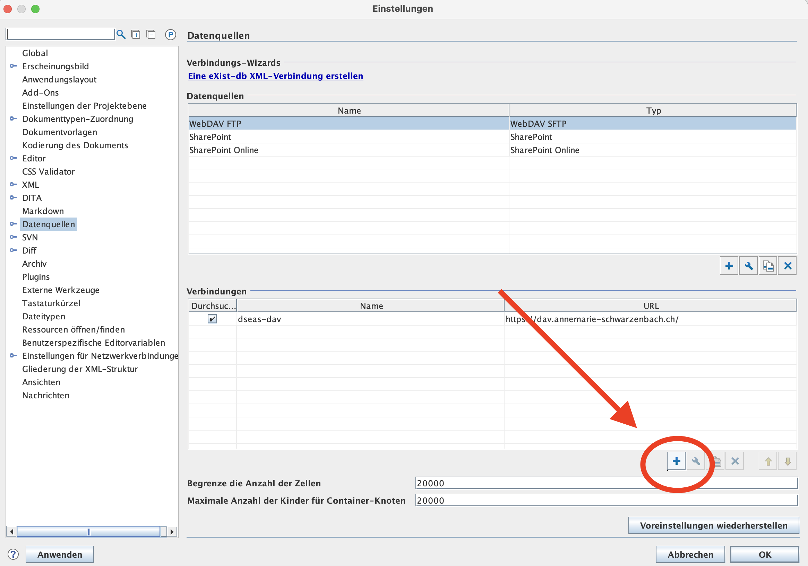


(Dataillierte WebDAV-Anleitung von Oxygen:https://www.oxygenxml.com/doc/versions/27.0/ug-editor/topics/configure-webdav-connection.html)

Einstellungen bei der Generierung einer neuen Verbindung:

- Hostname: https://dav.annemarie-schwarzenbach.ch  oder https://reverse-proxy.jcloud.ik-server.com/
- Benutzer: `dseas-dav`
- Passwort: `T0dInP3rsi3n`
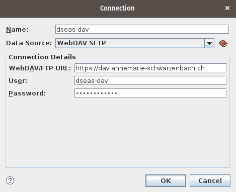


### 1.1 Export aus Transkribus
Vor der Benutzung von Oxygen müssen die Dokumente aus Transkribus exportiert und konvertiert werden. Hierfür verwenden wir das entsprechende [Export-Github-Issue](https://github.com/dse-as/workflow_IIIF-ATR-TEI/issues). Das Resultat sind jeweils zwei XML-Dateien im Ordner https://github.com/dse-as/workflow_IIIF-ATR-TEI/blob/main/_generated/2-base-TEI: die eigentliche TEI-XML-Datei mit der Form 'ProjektID.xml' (z.B. letter_0201.xml) und eine Datei mit den Koordinaten, die zurück auf das Digitalisat verweist, mit der Form 'ProjektID_facs.xml' (z.B. letter_0201_facs.xml). 

Beide Dateien müssen lokal (zwischen-)gespeichert werden (oder es gibt eine lokale Synchronisation via GitHub-Desktop, die das sicherstellt).

### 1.2 Upload in WebDAV-Ordnerstruktur

Beide auf GitHub erzeugten Dateien werden in entsprechende Ordner des WebDAV geladen, die analog aufgebaut sind: 
- TEI-Datei: 
    - Überordner aller TEI's: https://dav.annemarie-schwarzenbach.ch/data/sources/tei
    - Unterordner für die smallform-TEI's: https://dav.annemarie-schwarzenbach.ch/data/sources/tei/smallforms/
    - Unterordner für die letter-TEI's: https://dav.annemarie-schwarzenbach.ch/data/sources/tei/letters
        ->Beide Unterordner sind weiter unterteilt in nummerierte Ordner, die jeweils 100 Dateien umfassen sollen: smallform/00 = smallform_0001 - smallform_0099; smallform/01 = smallform_0100 - smallform_0199 etc. 
- Faksimile-Datei: https://dav.annemarie-schwarzenbach.ch/data/sources/facs
    -> Die restlichen Unterordner sind analog aufgebaut

Mithilfe obiger Links lässt sich das WebDAV bzw. die darin enthaltenen Dateien übrigens auch über einen Browser durchsehen, jedoch nicht bearbeiten.  

### 1.3 Bearbeitungsregeln: Sperren von Dokumenten etc.

:::warning
Bei der Arbeit im WebDAV ist zu beachten, dass in der Regel nur eine Person eine Datei auf Oxygen geöffnet haben kann (ist eine Datei - vom user selbst oder von jemand anderem - geöffnet, ist es mit einem Schloss-Symbol versehen). 
:::


- Achtung: Der Dateibaum aktualisiert sich nicht automatisch, sondern bildet den Initialzustand ab; d.h. zuweilen sieht man das Schloss nicht. Man kann aber immer verzeichnisweise neu laden (markieren und `F5`).
- Unabhängig davon, ob das Schloss-Symbol angezeigt wird, erscheint beim Öffnen eine Locking-Warnung. Die sollte nur ganz bewusst weggeklickt werden; normalerweise “Cancel” wählen und mit der Person, die in der Warnung angegegeben wurde, Kontakt aufnehmen (es kann sein, dass das Dokument nur aus Versehen noch geöffnet war und freigegeben werden kann).
- Dasselbe gilt für das Entsperren im Kontextmenü (d.h. entsperren nicht durch Doppelklick, sondern durch Rechtsklick): Nur im Notfall machen und auch dann nur, wenn die sperrende Person informiert wird

Sobald das Dokument in Oxygen hochgeladen wurde, sollte dessen Bearbeitungsstatus im Index auf 'ttf_o' geändert werden (mit entsprechendem Namenskürzel voran, z.B. dk_ttf_o). 

## 2. Metadaten im TEI-Header

Für diesen und alle weiteren Editionsschritte ist es oftmals sinnvoll, das Digitalisat bzw. Faksimile zum Abgleich der vorhandenen (Meta-)Daten herbeizuziehen (z.B. auf einem separaten Bildschirm). Das Digitalisat kann mit folgendem Button im Autor-Modus in einem IIIF-Viewer im Browser aufgerufen werden: 
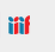
Alternativ kann das Dokument auch auf Transkribus in der Collection dse-as_finished aufgerufen werden; es ist jedoch zu beachten, dass es dort nicht mehr bearbeitet werden sollte, da der Arbeitsstand auf Transkribus nicht mehr abgerufen wird. 

Grundsätzlich gilt es, im Autor-Modus die Maske des TEI-Headers auf der Grundlage des Digitalisates, des tranksribierten Textes und der bereits vorhandenen Metadaten im Index zu befüllen. Im Text-Mode, d.h. im Code, muss überprüft werden, ob die Informationen auch dort korrekt auftauchen (z.B. keine Einträge verdoppelt sind, das kann in der Datumsmaske passieren). 

:::info
Zur Zeit sind noch nicht alle Masken für den TEI-Header im Framework. Für die bibliographischen Angaben der Dokumente, die mit dem Edendum zusammenhängen (publizierte Textstufe, Zweitpublikation zu Lebzeiten, posthume Editionen etc.) muss deshalb im Moment noch das jeweilige Code-Snippet im Text-Editor eingefügt und befüllt werden. 
Der entsprechende Code findet sich für die Kleinen Formen in folgendem exemplarischen TEI/XML: https://dav.annemarie-schwarzenbach.ch/sandbox/examples/teiheader_smallform.xml
Für die Briefe ist nur der Code für posthume Editionen und Übersetzungen relevant, auch dieser kann aus obigem XML entnommen werden. 
:::

Folgende **Regeln** sind zu beachten: 

### 2.1 Metadaten Kleine Formen
- Titel: 
    - Werktitel im Titel werden durch `<hi>[Werktitel]</hi>` hervorgehoben
    - Kleine Formen ohne erkennbaren Titel werden der verbreiteten Konvention gemäß durch einen sinnvoll langen Ausschnitt des Textbeginns betitelt und mit drei PUnkten abgeschlossen (z.B. smallform_609: "Herr! wie sich mich nähren, deine Himmelsvögel... "). Ausnahmen sind in der Schwarzenbach-Forschung etablierte Titel wie "Eine FRau zu sehen".
- Datum von Typoskripten und Manuskripten: Bei einem Entstehungszeitrum wird das Enddatum eingetragen

### 2.2 Metadaten Briefe
- Poststempel werden wie Datierung durch Absender:innen behandelt und in der Maske "Schreibdatum" eingefügt. Wo Poststempel und Datierung durch Absender:innen vorliegen und voneinander abweichen, ist letzteres Datum vorzuziehen  
- Eruierte Absendedaten (die nicht aus einem Poststempel hervogehen) werden in eckigen Klammern eingefügt und im Übersichtskommentar erläutert


Mit dem Ausfüllen der Maske 'Übersichtskommentar', der keine normierten Metadaten, sondern freie philologische Ausführungen enthält, kann zwar schon begonnen werden. Jedoch ist es in den meisten Fällen nötig, nach Abschluss aller anderen Editionsschritte in Oxygen nochmals zum Übersichtskommentar zurückzukommen. Zu Grundregeln des Übersichtskommentars siehe unten, [5.4](#54-Übersichtskommentar-im-TEI-Header), dasselbe gilt für die Verschlagwortung im TEI-Header, s.u, [5.3](#54-Übersichtskommentar-im-TEI-Header). 

Für smallforms gibt es die folgende Ausnahme, die Ergänzungen im Code benötigen:


### 2.3 Spezialfall: Kleine Formen als Typoksript oder Manuskript (aus Archiv)
Im Falle von Kleinen Formen aus dem Archiv wird dem Header nicht automatisch ein msIdentifier hinzugegeben (weil über die Hälfte der smallforms publiziert sind und nicht aus Archiven stammen). Bei smallforms aus Archiven wird deshalb folgender Code ganz zu Beginn von `<sourceDesc>` hinzugefügt (TEI verlang, dass es am Anfang steht). Dies kann mithilfe eines 'quickfix' gemacht werden, d.h. das Einfüguen des folgenden Codes wird von Oxygen vorgeschlagen, sobald eine smallform vorliegt, die im TEI-Header als Manuskript oder Typoskript definiert wird (Stand 9. April 2025 funktioniert dieser quickfix noch nicht).  

```xml=
<sourceDesc> 
    <msDesc> 
       <msIdentifier> 
          <repository/>
           <collection/>
           <idno/>
        </msIdentifier>
     </msDesc>

     <!--other sourceDesc stuff goes here-->
     
</sourceDesc>
```

Weitere Informationen im `<sourceDesc>` bei Archiv-Material: 
`<title level="u"/>`: steht für 'unpublished', damit ist die unpublizierte Textstufe gemeint (nicht, dass gar keine Textstufe publiziert wurde)
`<biblScope></biblScope>`: hier wird gewöhnlich die Seitenzahl eingefügt, im Falle von Archivmaterial kann die Kollation eingefügt werden (z.B. 4 S. Ts. m. hs. Korr.)

Danach kann in den Autor-Modus gewechselt werden und die Archivinformationen können dort in der Maske ausgefüllt werden. Das Feld "Zeitschrift" wird freigelassen. 
Eine Schematron-Regel überprüft zusätzlich, ob alle smallforms des Typs "Manuskript" und "Typoskript" den msIdentifier aufweisen. 

## 3. Strukturelle Auszeichnung

Nach Upload ins WebDAV und befüllen der Metadaten im TEI-Header wird im Code die Struktur des Textes festgehalten (auch der Autor-Modus, d.h. das Framework erlaubt punktuell eine Strukturierung, jedoch nur beschränkt). 

Für alle Auszeichnungen von Text bzw. Textblöcken im Text-Editor ist das Aufrufen des integrierten Schemas von größter Nützlichkeit. Es erlaubt, nachdem Text via Maus ausgewählt wurde, einen tag per Suche aus der Liste aller schema-gerechten tags auszuwählen oder selbst einen tag zu schreiben und den Text damit zu umgeben.
Shortcuts:
- Mac: CMD + E
- Windwos: CTRL + E
    

### 3.1 Grundlegende Strukturen (für Briefe *und* Kleine Formen)

#### a. Seitenbeginn und Zeilenbrüche (Autor-Editor)

**Seitenanfänge** sind in der Regegel schon aus dem Transkribus-Import vorhanden, können wenn nötig mit folgendem Framework-Button eingefügt werden: 
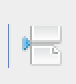

Bei jedem Seitenbeginn erscheint im Fliesstext folgendes Zeichen mit befüllbarer Maske: 
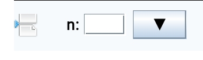
Die Textmaske wird nur befüllt, wenn eine Seitenzahl auf dem Dokument lesbar ist (abgebildet wird also nicht die projekteigene Seitenzählung, die geht bereits aus der automatischen Zählung der Digitalisate hervor). 

#### b. Paragraphen (Text-Editor)

Paragraphen können zwar durch custom-taggings in Transkribus vorbereitet werden, an vielen Stellen müssen sie jedoch auch dann noch im Code angepasst werden.  
- Bei custom-tagging von \p\ bzw. \:p\ mit \fml\, um paragraphen-tags bei Seitenumbrüchen als temporär zu markieren: Dort muss nun sowohl die FML-Warnung als auch der Paragraph selbst wieder gelöscht werden.
- Wo in Transkribus keine customtagging für Paragraphen verwendet wurde (weil die Paragraphen-Struktur z.B. sehr einfach ist, und sich Paragraphen über mehrere Seiten hinziehen wie bei vielen Briefen, oder weil andere tags wie head, byline, dateline etc nötig werden): Hier umschliesst die Konversion automatisch alle unvertaggten Text mit einem temporären Paragraphen und FML-Wrapper. 
    - Entweder muss nur die FML-Warnung gelöscht werden
    - Oder der Absatz muss mit dem korrekte Wrapper umschlossen werden (zu den diversen Taggings von spezifischen Grundstrukturen, s.u.)

#### c. Zeilen und Silbentrennung (Autor-Editor)

Zeilen werden direkt aus der automatisierten Zeilenerkennung von Transkribus importiert. Sollte bei der Korrektur in Tranksribus ein Fehler unterlaufen sein, können Zeilen mit folgendem Buztton im Autor-Modus getrennt werden: 
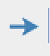

Silbentrennungen, die in der Leseausgabe zusammen mit den diplomatischen Zeilenbrüchen tilgbar sind, werden aus der Konversion von Transkribus automatisch importiert, wo ein Negationszeichen `¬`steht. Sie werden am Zeilenbeginn im Autor-Modus durch pinke (statt schwarze) Pfeile markiert (der Silbentrenntstrich fällt weg und wird für die Leseausgabe wieder ergänzt).
Wo in Transkribus das Negationszeichen vergessen ging, kann im Autor-Modus mit einem Klick auf den Zeilenbeginnpfeil 'break no' ausgewählt werden.
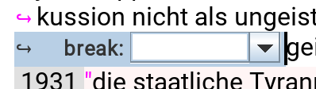

#### d. Verse (Text-Editor)
Im Gegensatz zu Prosa-Zeilen, werden Verszeilen auch in Leseausgaben weiterhin gebrochen, deshalb müssen sie gesondert ausgezeichnet werden. Dabei sollte folgendes Code-Schema verwendet werden (vgl. auch smallform_0607):
```xml= 
<lg> 
<l> Vers 1 </l>
<l> Vers 2 </l>
</lg>
```

### 3.2 Grundstruktur Briefe 

- Opener: `<opener>...<opener/>` Diese Textstruktur enthält alle Informationen, die einen Brief eröffnen (Datum, Ort, Anrde ggfls. Adresse)
    - Dateline:`<dateline>`: Umfasst auch Ortsangaben
    - Salute = Begrüssungsformel (mit oder ohne Namen): `<salute>`
- Salute oder dateline im Paragraph: Findet sich die Anrede auf derselben Zeile oder sogar im selben Satz wie der eigentliche Briefbeginn, wird dies folgendermassen ausgezeichnet: `<seg type="salute">...<seg/>` bzw. `<seg type="dateline">...<seg/>`
- Closer: `<closer>`umfasst alle Informationen nach dem Haupttext:
    - Salute = auch Abschiedsformel, ggfls. auch der einleitende Satz (z.B.: "Bitte grüße mir auch ganz herzlich Deine Mutter! Liebe Grüße,")
    - Signed = Unterschrift: `<signed>`
- Postscriptum: `<postscript>`
    - Bei mehrerem Postscripten ist es nötig, diese in einen neuen `<div>`-Wrapper zu packen. 
- Briefumschläge und Adress-Seiten von Postkarten: `<div type="back">`
- Postmarken: 
```xml=
 <seg type="postmark">
          <date></date>
          <placeName/>
        </seg>
```
- Adress-Blöcke (z.B. auf Umschlägen) werden von einem 'anonymous block' `<ab>`umgeben und dann Linie für Linie codiert und jeweils später referenziert: 
```xml=
<ab>
    <address>
        <addrLine><lb xml:id="p001_l_276"/>M. <rs type="person" key="person_0006" xml:id="r7">Claude Bourdet</rs></addrLine>
        <addrLine><lb xml:id="p001_tr_1_tl_21"/>Boleystr. 34</addrLine>       
        <addrLine><lb xml:id="p001_tr_1_tl_25"/><rs type="place" key="place_0088" xml:id="r9">Zurich</rs></addrLine>     
        <addrLine><lb xml:id="p001_tr_1_tl_28"/><rs type="place" key="place_0110" xml:id="r8">Schweiz</rs></addrLine>
    </address>
</ab>
```


### 3.3 Grundstruktur Kleine Formen

**Titel/Untertitel/Zwischentitel**: `<head>...</head>`
- Jeder (Unter-/Zwischen-)Titel wird von einem neuen `<div>`-Element eingefasst. Zur genauen Codierung siehe [hier im Editionsmodell](https://hackmd.io/ccjyBww-TpSE6ivZjWDPig?view=&stext=21148%3A19%3A0%3A1744213033%3Au4jDfh).
- Das erste `<div>`-Element (`<div type="smallform">`) wird bereits durch die Konversion erzeugt, deshalb muss bei lediglich einem Titel darauf nicht geachtet werden. 

**Autorennamen"**: `<byline>Von Annemarie SCharzenbach<byline/>`
- Falls die byline im Fliesstext ist, kann analog zum salute vorgegangen werden: `<seg type="byline">...<seg/>` 

**Spalten** werden dort ausgezeichnet, wo eine spaltenförmige Textregion beginnt und wo das Spaltenlayout (d.h. alle Textregionen mit Spalten) endet. Dazwischen werden Spaltenbrüche ausgezeichnet. Texblöcke in Fotoreportagen, die keine mehrspaltige Form haben, werden nicht als Spalten ausgezeichnet. 
- Beginn des Spaltenlayouts: `<cb type="start"/>`
- Spaltenbrüche: `<cb/>` 
- Da Spalten auf Transkribus meist Textregionen sind, kann der Spaltenbeginn/-bruch einfach erkannt werden und die Textregion, die zunächst noch als 'milestone' codiert ist, in ein `<cb/>`-Element unbenannt werden: 
    -`<milestone unit="textregion" xml:id="p001_r_79"/` => `<cb type="start" xml:id="p001_r_79"/>` oder bei Spaltenbruch `<cb xml:id="p001_r_79"/>`
- Ende des Spaltenlayouts (meist am Ende eines Artikels, d.h. am Ende einer Textregion): `<cb type="end"/>`
- Spalten können zwar nicht über das Framework hinzugefügt werden, erscheinen dort jedoch als folgendes Zeichen, das angeklickt werden kann, um es in ein Spaltenbeginn oder -ende umzuwandeln: 
    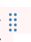

**Bilder**: Zur Struktur-Codierung von Bildern und Bildunterschriften: 
```xml=
<milestone unit="textregion" xml:id="p001_r_8"/>
<figure>
    <head resp="editor"> [Projekteigener Titel für das Bild]</head>
         <milestone unit="textregion" xml:id="p001_r_4"/>
                 <p>
                 [Absätze mit der Bildbeschriftung im Edendum]   
                 </p>
</figure>
```

- In der Konversion werden die Paragraphen der Bildunterschriften und ihre dazugehörigen milestones ausserhalb des Figure-Elements abgelegt, jedoch mit einem FML-Tag als nachzubearbeiten markiert. 

Die Codierung ganzer Fotoreportagen ist Stand 9. April 2025 noch nicht fertig festgelegt. 


## 4. Auszeichnungen von Renderings und Texteingriffen (Text- oder Autor-Editor)


- Kursiv, fett, gesperrt, unterstrichen, hochgestellt, Zitate

    - Alle diese Renderings können ebenfalls bereits aus Transkribus importiert werden, sind aber auch durch folgende Buttons im Framework einfügbar: 
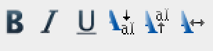

- Für Handschriften, insbesondere Briefe: Geminationen (d.h. Verdoppelungsstriche über m oder n): 
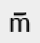


Weitere Renderings, hier jeweils mit dem Editionsmodell verknpüpft: 
- [Sofortkorrekturen durch Autorin](https://hackmd.io/ccjyBww-TpSE6ivZjWDPig?view=&stext=5845%3A53%3A0%3A1744201074%3A7Mv6bN)
- [Korrekturen/Emendation druch Editor:innen](https://hackmd.io/ccjyBww-TpSE6ivZjWDPig?view=&stext=6596%3A25%3A0%3A1744201140%3A1mrn48)
- [Unleserlicher Text (wegen Handschrift/Zerstörung)](https://hackmd.io/ccjyBww-TpSE6ivZjWDPig?view=&stext=6946%3A25%3A0%3A1744201180%3AW71eAr)
- [Abkürzungen](https://hackmd.io/ccjyBww-TpSE6ivZjWDPig?view=&stext=7736%3A11%3A0%3A1744201296%3AQySIP_) werden in der Regel in der Codierung aufgelöst

## 5. Inhaltliche Auszeichnung (Autor-Editor)

### 5.1 Referenzierung von Entitäten

Die Referenzierung von Entitäten erfolgt im Falle der "externen" normalerweise komplett über das Framework, kann aber auch immer händisch nachgetragen werden: 
`<rs type="person" key="#id" xml:id="#xml-id">`
`<rs type="place" key="#id" xml:id="#xml-id">`
`<rs type="person" key="#id" xml:id="#xml-id">` etc.
Die XML-ID kann durch einen 'Quickfix' hinzugefügt werden (rote Warnung anklicken und Quickfix auswählen). Stand 9. April 2025 funktionieren die quickfixes jedoch noch nicht zuverlässig. 

#### a. "Externe" Entitäten (= keine eigenen Edenda)
Für all diese Entitäten gilt, dass sie normalerweise aus einer bestehenden Liste im Framework ausgewählt werden können. Fehlt dort eine gewünschte Entität, können Sie selbst angereichert werden. Bevor fälschlich Duplikate erzeugt werden (insbesondere bei Ortnamensvarianten!) kurz zu überprüfen, ob Sie in de projekteigenen Datensammlung (Google-Sheet oder XML-Datei) unter anderem Namen vorhanden sind.
"Externe" Entitäten werden auf drei verschiedene Weisen verwaltet:

1. **Im [Google-Sheet](https://docs.google.com/spreadsheets/d/1pzY0f-4SyWGZEd3-kF2E-djY54qsr9HrRIljVDG5gkc/edit?usp=sharing)** -> wird direkt im Framework durch folgende Buttons integriert: 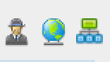

    - Orte: Daten aus [Geonames](https://www.geonames.org/) 
    - Personen: Daten aus der [GND](https://swb.bsz-bw.de) 
    - Intitutionen: 'Organisationen'-Daten aus der [GND](https://swb.bsz-bw.de) 
        - GND-Personen- und Institutionen-Daten können gemäß Workshop der ZB Zürich selbst angereichert werden. Wenn weitere Schlagwörter gewünscht sind, kann Elias diese in der GND-Redaktion Zürich beantragen. 
        - Zeitungen und Zeitschriften werden als Organisation (type 'periodkikum') aufgenommen, obschon sie im `<bibl corresp="ProjektID"`-Element des TEI Headers als Werk aufgeführt werden. Mit der Entität wird immer sowohl die Institution (Redaktion) als auch das 'Werk' bezeichnet. 
            - GND bietet Zeitungen und Zeitschriften zum Teil sowohl als Werk wie auch als Organisation (Redaktion) an. Da jedoch kleinere Periodika nur als Wekr aufgeführt sind, soll konsequent nur auf die GND-Werk-Normdatei verwiesen (bzw. solche ins Google-Sheet aufgenommen) werden.   
2. **In [Zotero](https://www.zotero.org/groups/5746334/dse_as_bibl-id/library)**: Werke, die nicht von uns ediert werden. -> Werden im Framework über folgenden Button integriert:
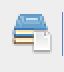
Hierzu zählen:
    - Zweitpublikationen zu Lebzeiten (Ordner "surrogate")
    - Posthume Editionen (Ordner "edition")
    - Posthume Übersetzungen (Ordner "translation")
    - Forschungsliteratur
        - Die genannten Ordner sind nicht-topologisch, sondern funktionieren wie ein Label; Einträge können in mehreren Ordnern erschienen und 'fliessen' immer in der Hauptcollection zusammen
3. **In XML-Dateien auf dem WebDAV** (Ordner data/meta/lists) -> Können aus Dropdown-Menüs im TEI-header ausgewählt werden (später ggfls. auch per Button): 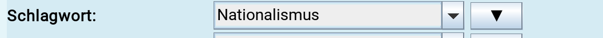
    - Schlagwörter = keywords.xml: 'Sachbegriffe' aus der [GND](https://swb.bsz-bw.de) 
    - Reisen und Events = events.xml: Selbsterstellte Daten, die aber wiederum mit "externen" Entitäten wie Orten und Personen angereichert im XML werden. 


#### b. "Interne" Entitäten (= eigene Edenda)

Wenn auf projekteigene smallforms, letters oder images verwiesen werden soll, muss dies händisch geschehen. Hierfür wird die Dokuemntart (smallform, letter, image) als type und seine spezifische ID als key eingefügt: 
`<rs type="smallform" key="smallform_0240" xml:id="f3x_4yj_y2c">...</rs>`
Der ID-key wird jeweils dem entsprechenden Google-Sheet-Index entnommen, die XML-ID kann via Quickfix erzeugt werden (s.o.). Wenn es den Editorinn:en sinnvoll erscheint, kann der Werktitel in einem 'ana'-Attribut zur Verständigung mit den anderen Editor:innen hinzugefügt werden.


#### c. Regeln zur Referenzierung der Entitäten
- **Verschachtelungen** bzw. doppeltes Referenzieren sind zu vermeiden, da es im Frontend schwer darstellbar ist. Daumenregel: Das Spezifischere geht vor: Werk vor Person, Institution vor Ort, Institution vor Person. 
    - Empfohlen wird jedoch ein 'gestaffeltes' Referenzieren. Am Beispiel  der Erwähnung von "Thomas Manns Zauberberg" soll 'Thomas Manns' als Person, 'Zauberberg' als das Werk referenziert werden.
- Grundsätzlich wird jede **namentlich genannte Entität** (= Ort, Institution, Person, Werk) im Autor-Editor referenziert, selbst wenn sie im selben Satz mehrfach vorkommt.
    - Zu namentlichen Nennungen zählen wir auch Abkürzungen (die in der Codierung normalisiert werden), Spitznamen (die im Registereintrag als Namensvarianten aufgeführt sein sollten) oder Berufsbezeichnungen ("der Professor").  
- Wo eine Entität nur als **Pronomen oder Präposition** ("er", "dort") auftaucht, wird sie in der Regel nicht referenziert. Ausnahme: Wenn sich die Entität nicht ohne weiteres aus dem Kontext des vorliegenden Dokumentes erschliessen lässt, d.h. das Wissen über andere Dokumente vorausgesetzt wird, kann die Entität auch im Falle von indirekter Nennung referenziert werden. Es empfiehlt sich in diesem Fall jedoch, zusätzlich in einem Stellenkommentar zu erläutern, warum hier welche Entität referenziert wurde (d.h. auch auf das kontexualisierende Dokument zu verweisen). 

### 5.2 Textstellen-Kommentar

- Die Textstellen-Kommentare sollten über die Erklärung von wenig bekannten Worten und Einzelsachverhalten hinausgehen und idealierweise ein tieferes Verständnis der biographischen, historischen und literarischen Kontexte der Edenda ermöglichen. 
- Stellenkommentare sollten nicht hinter die Kommentierung durch die bestehenden Editionen (insbesondere Perrets sowie Fähnders/Schaffers/Decock) zurückfallen. Ihre Stellenkommentare können zwar nicht 1:1 übernommen, sollten aber sinngemäß aufgenommen werden (können durch die Verknüpfung mit Entitäten oft kürzer ausfallen!). 
- Die Edenda sollen durch Kommentare untereinander und wo nötig mit Intertexten oder Sekundärtexten verbunden werden (Verweise auf andere smallforms/letters, s.o.). 

Stellen-Kommentare werden auch dazu verwendet, auf Fotografien im Archiv zu verweisen ("interne" Entität: type="image"), die unmittelbar einen Bezug zu dieser Textstelle haben. Damit wird der Forschungsfokus des Projektes auf **Intermedialität** unterstützt (der Kommentar wird entsprechend mit dem "Meta"-Schlagwort 'Intermedialität' versehen). 

#### a. Referenzierungen im Textstellen-Kommentar
Alle Entitäten im Kommentar werden konsequent wie im Primärtext referenziert. 

#### b. Verschlagwortung eines Textstellen-Kommentars

Die Verschlagwortung findet entweder im Stellen-Kommentar oder im TEI-Header statt. Textstellen können also nicht ohne zeitgleiche Kommentierung Verschlagwortet werden, was eine Übermässige Verschlagwortung vorbeugen soll. 
Im Stellen-Kommentar werden Schlagworte pro Kommentar durch einen 'Pointer' am Ende des Kommentars eingefügt, sie gelten für den ganzen Kommentar: 
```xml
<ptr type="keywords" target="4114051-5" ana="Nationalität"/>    
```
- Das Attribut 'ana' ist lediglich für das Verständnis durch die anderen Editor:innen einzufügen, es hat keinen technischen Nutzen. 
- Für jedes Schlagwort wird ein neues `<ptr>`-Element eingefügt.
- "Meta-Verschlagwortung": Stellenkommentare können auch bezüglich ihrer inhaltlichen Funktion verschlagwortet werden, z.B. um hervorzuheben, dass es sich beim Kommentar um das Thema "Intertextualität", "Intermedialität" oder um ein "Interpretament" (quasi-lexikalische Sachworterkärung) handelt. 

### 5.3 Verschlagwortung im TEI-Header

Bei der Verschlagwortung ganzer Dokumente ist darauf zu achten, dass eine allzu lange Liste der Schlagwörter zu Beliebigkeit führen kann. Längere Texte können mehr Schlagwörter aufweisen (5-8), kürzere sollten sich auf 4-5 begnügen.

Es ist im Sinne des Projektes, dass die Header-Verschlagwortung den einzelnen Forschungsinteressen der Editor:innen dient, eine 'objektive' Verschlagwortung kann deshalb nur graduell angestrebt werden.  

### 5.4 Übersichtskommentar im TEI-Header

Was der Übersichtskommentar NICHT ist: Kein Regest bzw. keine Zusammenfassung des Inhalts. Inhaltliche Aspekte können hervorgehoben werden, wenn sie für die Kontextualisierung notwendigerweise referiert werden müssen. 

Möglicher aufbau des Übersichtskommentars: 
- **Entstehungskontext**: In der Regel biographische Kontexte wie Reise/Lebenssituation/Konflikt/Thema/Freundschaft etc.  Ästhetische/literarischen Eigenarten, wenn relevant (z.B.: ästhetisierende/narrativierende Wiederaufnahme eines zuvor sachlich-journalistisch bearbeiteten Themas).
- **Textträger** (falls unpubliziert): Spezifika der Materialität oder der Schreibutensilien (z.B. auch Zustand des Papiers oder der Schrift, handelt es sich um ein Durchschlag etc.). 
- **Publikationskontext** (falls publiziert): Thematisch ähnliche Publikationen; Hintergründe, warum Publikation in diesem Medium/zu dieser Zeit erschien. Ggfls. Verweis auf Kommunikation/Vereinbarungen mit den entsprechenden Redaktionen.  
- **Historischer Kontext** (falls relevant): Breitere Einbettung in Zeitgeschichte (z.B.: Anschluss von Österreich).  

-> Diese Liste möglicher Aspekte des Übersichtskommentars ist nicht abschliessend und kann erweitert werden.

Auch in der Verfassung des Übersichtskommentars dürfen die eigenen Forschungsinteressen einfliessen. Wichtig ist, dass grundlegendes Wissen über Schwarzenbach oder die Zeit nicht vorausgesetzt wird (supponierbarer Wissensstand: Schweizer Maturand:in). 

## 6. Korrekturlesen (Text und Autor-Editor)
Nach Abschluss der Edition in Oxygen wird der Bearbeitungsstatus des Dokumentes im Index auf 'ttf_of' (of=oxygen finished) gesetzt und ein:e Editor:in (in der Anfangsphase Elias für die Kleinen Formen und Daniela für die Briefe) gebeten, den Text Korrektur zu lesen (via Discord oder Mail). Der:Die Korrektor:in setzt danach ihr Kürzel mit dem Status'p' an. Z.B. 'jsg_ttf_of ez_p'. Bei Abschluss der Korrektur wird es um 'f' (für finished) ergänzt: 'jsg_ttf_of ez_pf' 

Strukturelle Korrekturen oder Ergänzungen  werden bei Kleinigkeiten stillschweigend im Text-Editor gemacht. Bei größeren Änderungen im Text-Editor kann ein XML-Kommenatr eingerügt werden (s.u.). 

Für das inhaltliche Korrekturlesen kann der Oxygen-eigene Korrektur- und Kommentarmodus im Autor-Editor verwendet werden. Er besitzt weitgehend dieselben Funktionalitäten wie der Korrekturmodus von Word. 
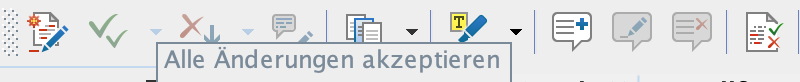
:::warning
Nach dem Korrekturlesen müssen alle in diesem Modus erstellten Kommentare/Korrekturen angenommen/verworfen werden!
:::

Alternativ können auch XML-Kommentare folgendermaßen eingefügt werden: 

``` xml
  <!--Das ist ein XML-Kommentar-->
```

Bei Problemen/Unklarheiten, die auch im Korrekturlesen nicht gelöst werden konnten, empfiehlt es sich im Notfall, diese Form des Kommentars stehen zu lassen. 


