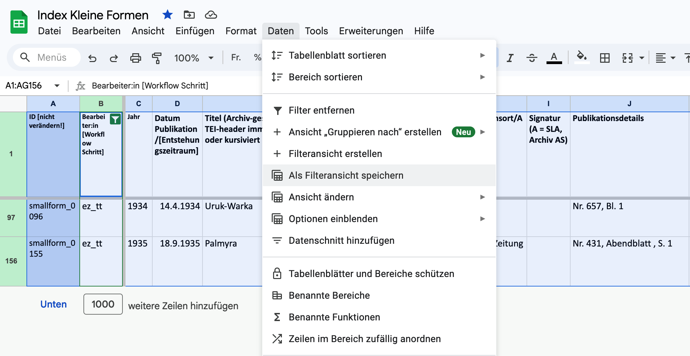
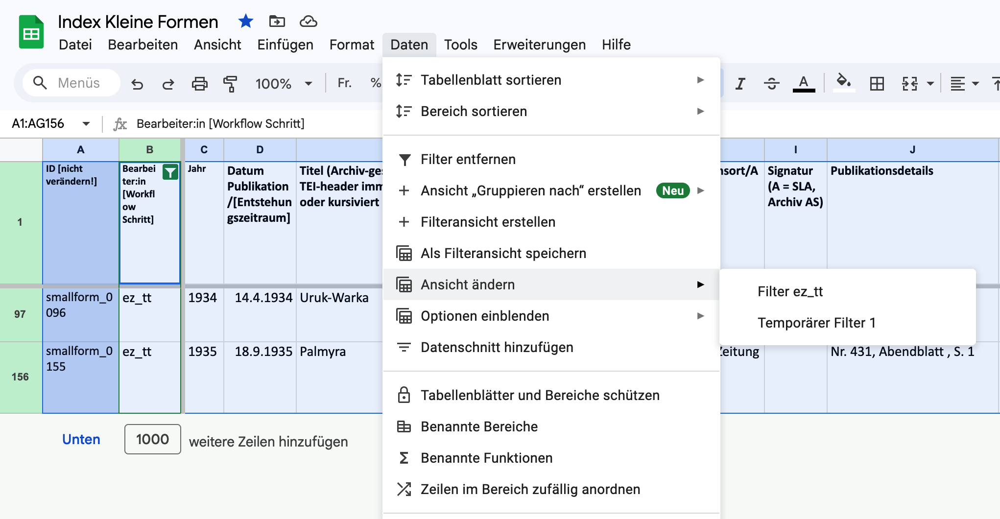
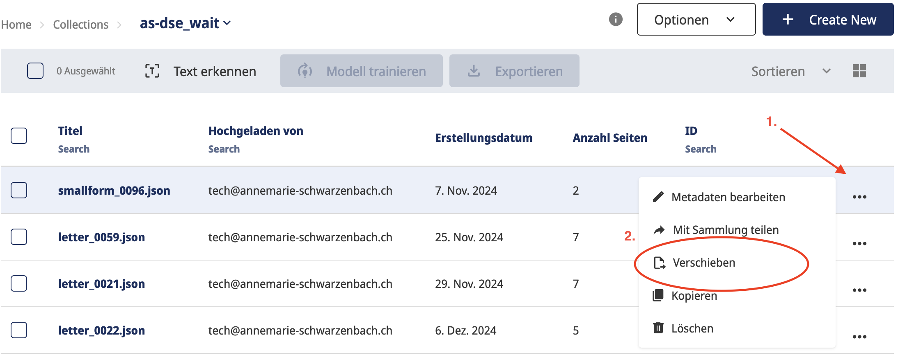
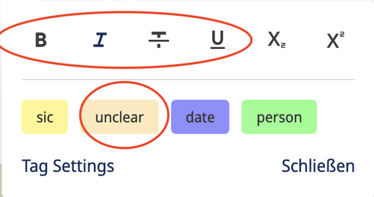
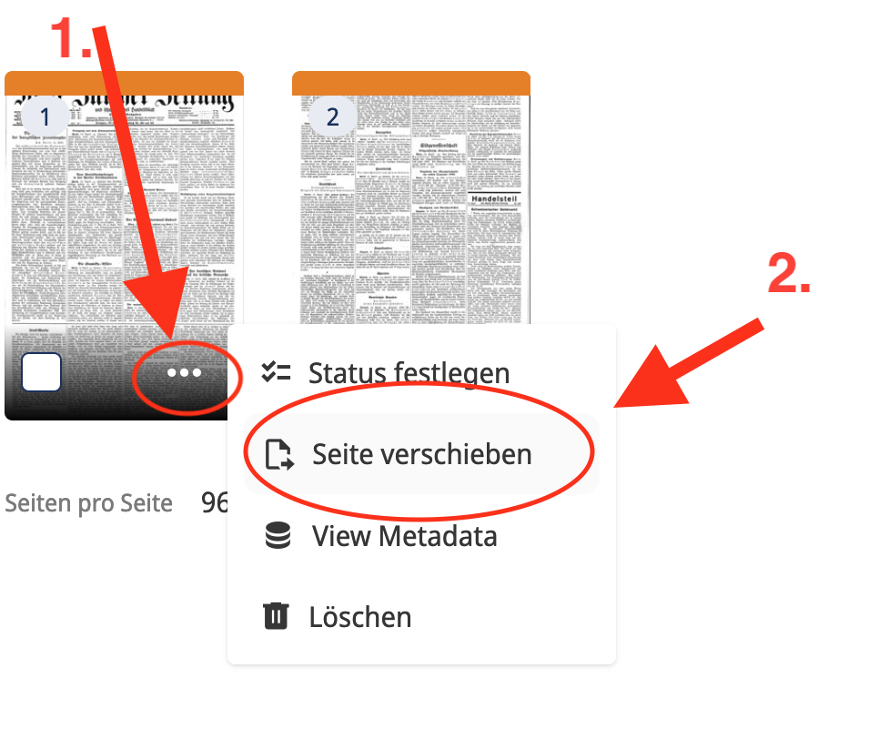

# Dokumentation Transkribus

[toc]

## Allgemeine Hinweise

Für alle generellen Informationen zu Transkribus sei auf dessen offizielle [Dokumentation](https://help.transkribus.org/de) verwiesen. Weitere generelle Informaitonen zur Transkription in DSE-Projekten finden sich im [Online-Handbuch zur Erstellung einer digitalen Edition](https://digital-editions.pages.uzh.ch/proto4diged/handbook/) im Kapitel [2.2 Transkription, ATR und Annotation](https://digital-editions.pages.uzh.ch/proto4diged/handbook/2_Editionsarbeit/03_Transkription/).

Im Folgenden sind nur die relevanten Workflows für die DSE-AS dokumentiert. 

:::warning
:warning: **Problemlösungen**
Die Funktionen von Transkribus können sich sehr schnell ändern, ohne dass bei der Programmnutzung ausdrücklich auf diese Änderungen hingewiesen wird (keine Versionshinweise etc.). Es ist empfehlenswert, sich bei neu auftretenden Problemen mit Transkribus möglichst schnell mit den anderen Projektmitarbeitenden über unseren [Discord-Server](https://discord.gg/Bk4TsCSR) auszutauschen.  
:::

## Webapp
Die DSE-AS verwendet die [Webapp](https://app.transkribus.org/) von Transkribus; der [eXpert-client](https://transkribus.eu/TranskribusX/releases/), d.h das stand-alone Programm, wird für das Projekt nicht empfohlen, da seine technische Unterstützung durch die Entwickler nicht gewährleistet ist und in Zukunft nicht alle Funktionalitäten damit abgedeckt sind (zurzeit besitzt der client jedoch z.T. andere/mehr Funktionalitäten als die Webapp).

## Prozesskontrolle: Arbeitsstand in Metadaten

Für den Überblick, welche Daten auf Transkribus hochgeladen werden (müssen), sind die jeweiligen **Metadaten-Tabellen** der [Kleinen Formen](https://docs.google.com/spreadsheets/d/1S2Qun726gyqUKr2Yb5vW9RaGPlo8vZ43qbTV-xryyEo/edit?usp=sharing) und der [Briefe](https://docs.google.com/spreadsheets/d/1KgZmtgZUEKx6o48KXTAYxWHhsOVrIxyOElFAUUOIc98/edit?usp=sharing) relevant: Der Arbeitsstand (mindestens Transkribus-Upload und -Export) muss in Spalte B jeweils so verzeichnet sein, dass die personelle Zuständigkeit für jedes Dokument ersichtlich wird (z.B. Spalteneintrag 'ez_t' [= transkribus upload elias zimmermann]). Die zu verwendenden Abkürzungen sind auf Arbeitsblatt 2 der Tabellen notiert.

Die Metadaten-Tabellen lassen sich mit Filterfunktionen schnell durchsuchen (etwa der eigene Arbeitsstand abfragen). Leider wird durch die Filterung jedoch in der Regel auch die Ansicht für alle anderen Benutzenden verändert. Das lässt sich umgehen, indem Filteransichten definiert werden, die, wenn abgerufen, nur für den:die Abrufende:n sichtbar ist. 
Zum Erstellen einer Filteransicht klickt Ihr auf den Reiter 'Daten' und dort auf den Unterpunkt 'Als Filteransicht speichern':

Danach könnt Ihr die entsprechend gefilterten Tabellenansichten jederzeit wieder unter 'Ansicht ändern' auswählen. Wie Ihr seht, habe ich mir einen Filter für meine Dokumente in der Collection 'dse-as_work' erstellt, um die Übersicht zu erhalten (die ich sonst schnell verliere, weil nun alle diverse smallforms in work hochladen).

## Grundprozess: Upload - Verarbeitung - Export

Die DSE-AS verfügt über vier Collections (Dokument-Ordner) auf Transkribus, zu denen alle Editor:innen Zugang benötigen: 
- as-dse_wait
- as-dse_work
- as-dse_finished
- as-dse_delete

### 1. Upload 
Der **Upload** von Faksimiles (d.h. Bilderquellen) in Transkribus (siehe Github-[Issue: IIIF Upload](https://github.com/dse-as/workflow_IIIF-ATR-TEI/issues/new?assignees=octocat&labels=task%3Aiiif-upload&projects=octo-org%2F1%2Cocto-org%2F44&template=0-initiate-upload.yml&title=%5BIIIF+Upload%5D%3A+)) erfolgt in der Regel in die Collection 'as-dse_wait' (default-Einstellung muss nicht geändert werden). Dort können beliebig viele Dokumente auf ihre weitverarbeitung 'warten'. Möglich ist ein Upload von mehreren Dokumenten aufs Mal (Eintragung des Uploads in der Metadaten-Tabelle, [s.o](##Prozesskontrolle:-Arbeitsstand-und-Metadaten), nicht vergessen!). Es ist dabei empfehlenswert, übersichtliche 'Arbeitspakete' hochzuladen, z.B. eine Quantität, die sich innerhalb einer Woche verarbeiten lässt. Im Falle eines falschen Uploads oder eines fehlerhaften IIIF-Manifestes kann das dokument in 'as-dse_delete' verschoben werden (da Löschungen nicht möglich sind).
  
### 2. Transkription 
Die **Verarbeitung**, d.h. Transkription, Erstkorrektur und minimale Auszeichnung der Texte, erfolgt in der Collection 'as-dse_work'. Hierfür wird das Dokument von 'as-dse_wait' nach  'as-dse_work' verschoben (nicht kopiert!): 
Die eigentlichen **Transkriptions-Arbeitsprozesse**, d.h. die Erzeugung des Layouts und die automatische Tranksription mithilfe verschiedener KI-Modelle, variieren  stark nach Dokumenttypus und werden deshalb [unten](##Vorgehen-nach-spezifischen-Dokumenttypen) gesondert erläutert. 
::: warning 
ACHTUNG: Nur in der Collection 'as-dse_work' ist die automatische Texterkennung (ATR) maximal effizient und mit allen ATR-Modellen durchführbar. Die vom Projekt gekauften 'professionellen' Transkribus-Credits, die für ATR benötigt werden, sind nur in dieser Collection freigegeben. 
:::

### 3. Erstkorrekturen und Auszeichnungen
Auch das Ausmaß der **Erstkorrektur und Auszeichnung**, die auf die Transkription erfolgt, hängt von unterschiedlichen Dokumenttypen ([s.u.](##Vorgehen-nach-spezifischen-Dokumenttypen)) ab. Ihnen allen aber sind drei projekteigene tags gemein, die wie alle projekteigenen tags nach dem Export automatisch in eine TEI-XML Codierung konvertiert werden: 

- Paragraphen werden mithilfe des tags `\p\`...`\:p\` gekennzeichnet. Die Anwendung dieses tags kann insbesondere für die Kleinen Formen nützlich sein, ist aber letztlich fakultativ, da sich Absätze auch in Oxygen definieren lassen (dort jedoch ist der Abgleich mit dem Faksimile umständlicher).
- Leere Zeilen, die Transkribus zuweilen aus Versehen generiert und die sich schwer manuell löschen lassen, werden druch das tag `\del\`(= delete) gekennzeichnte
- Projekteigene tags, die nur vorübergehend Anwendung finden, wie z.B. Paragraphen-endtags am Ende einer Seite (ohne Paragraphen-Ende, stellt die wohlgeformtheit des TEI-XMLs sicher) werden mit `\fml\` (= fix me later) kombiniert, also z.B. `\fml\\:p\`. 
    
:::danger
Projekteigene Transkribus-Tags dürfen nie zusätzlich mit Transkribus-Renditions (z.B. italic) getaggt werden. Dies führt zum Fehlschalg der Konversion. 
:::

-> 5 Formatierungs-tags können von Transkribus benutzt werden, sie werden automatisch beim Doppeklick auf einen transkribierten Text eingeblendet: bold, italics, strikethrough, underline und unclear. 

Während der Erstkorrektur können auch bereits  **Vorbereitungen für die Codierung und Normalisierungen** durchgeführt werden, die in Oxygen umständlicher sind. So empfehlen wir insbesondere folgende Eingriffe: 

1. Hyphen (Trennstriche), die eine Silbentrennung am Ende der Zeile vornehmen, werden als Negationsstriche geschrieben`¬`. Transkribus macht dies in vielen Fällen automatisch, kann jedoch nicht zwischen einer Silbentrennung und einer Trennung von Wortbestandteilen unterscheiden, weshalb jedes automatisch erzeugte `¬` überprüft werden muss. Das Negationszeichen wird beim Export in der Konversion zur Codierung `break= "no"` umgewandelt (das Hyphen wird gelöscht und nur in der diplomatischen Umschrift wieder eingeblendet). 
2. Doppeltrennstriche bzw. Gleichzeichen mit der Funktion eines Trennstriches`=` werden zu Trennstrichen oder Negationszeichen (s.o.) normalisiert. 
3. Anführungszeichen, die durch Transkribus nicht erkannt wurden, können bereits normalisiert als `"`...`"` (o.ä.) wiedergegeben werden, da Anführungszeichen in Oxygen sowieso normalisiert werden oder im Falle von Zitaten als `quote` ausgezeichnet werden. 
4. `...` setzen wir normalisiert mit einem Spatium vom Text ab, d.h. "Wahltermin beibehalten ... " 

:::info
In Transkribus wird auch die **richtige Reihenfolge der Seiten** überprüft und ggfls. angepasst. Im Falle der Briefe ist dies oft der Fall, da hier folgende Reihenfolge am besten schon auf Transkribus hergestellt wird: 1. Brieftext; 2. Anhänge (Fotografien/Beilagen etc.); 3. Couvert. Im Falle von Postkarten wird zuerst der Text-, dann die Bildseite gezeigt. 

:::

### 4. Export 
Nach erfolgreicher Verarbeitung wird das Dokument von 'as-dse_work' nach 'as-dse_finished' verschoben. Der **Export** erfolgt aus der Collection 'as-dse_finished' mithilfe des GitHub-[Issue: Transkribus export](https://github.com/dse-as/workflow_IIIF-ATR-TEI/issues/new?assignees=octocat&labels=task%3Atranskribus-export&projects=octo-org%2F1%2Cocto-org%2F44&template=transkribus-export.yml&title=%5BExport%5D%3A+). Im Gegensatz zum Upload kann jeweils nur ein Dokument exportiert werden. 

### [5. Ersetzen/Ergänzen eines Digitalisats]

::: warning
Dieser - hoffentlich selten nötige -Arbeitsschritt ist heikel und benötigt ggfls. das Wissen, wie toml-Dateien erzeugt/geändert werden können. Er sollte mit dem Gesamtteam abgesprochen bzw. durch erfahrene Mitarbeiter:innen überprüft werden. 
:::

Für den Fall, dass die hochgeladenen Dokumente fehlerhaft oder unvollständig sind, gibt es die Möglichkeit, manuell Einzelseiten zu ersetzen/ergänzen: Auf Dokumentebene "Seite Hinzufügen" anklicken:

Dann kann die korrekte/verbesserte Seite aus dem SwitchDrive-Ordner 'Digitalisate' hochgeladen werden. Es ist zu beachten, dass das Digitalisat denselben Namen tragen muss, das im spezifischen IIIF-Manifest (https://iiif.annemarie-schwarzenbach.ch/presentation/) dafür vorgesehen ist. 

Wenn die Seite bislang nicht im IIIF-Manifest aufgeführt war (z.B. weil es vergessen wurde oder weil zunächst nicht klar war, dass ein Dokument fehlt) muss das IIIF-Manifest erneut mithilfe einer toml-Datei erzeugt werden.

Wichtig ist, dass **auf Transkribus die Namen der Einzelseiten eines Dokumentes und ihre Reihenfolge mit ihrem IIIF-Manifest identisch sind**, auch wenn Einzelseiten nicht mihilfe des IIIF-Manifestes automatisiert hochgeladen worden sind. Ansonsten werden den Seiten im Zuge des Exports/der TEI-Generierung falsche Digitalisate zugewiesen. Mögliche Folgen in der späteren Darstellung der Digitalisate auf dem Web-Interface der DSE (die auf das IIIF-Manifest zurückgreift) sind eine falsche Abfolge/Präsentation bzw. eine Diskrepanz von Transkription und angezeigtem Digitalisat. 

## Vorgehen nach spezifischen Dokumenttypen
Transkribus ist noch wenig spezialisiert auf komplexe Darstellungstypen (insbesondere Spalten werden im default-modus sehr schlecht transkribiert), weshalb diese z.T. zusätzliche manuelle Anpassungen benötigen. Im Folgenden werden die Arbeitsschritte vom einfachen bis zu komplexen Dokumenttypen (und d.h.: wenig bis vielen manuellen Anpassungen)  erläutert. Für Editor:innen ist nicht jeder Dokumenttypus relevant.

### 1. Typoskripte und spaltenlose Drucke ohne handschriftliche Eingriffe (Briefe und Kleine Formen)
Der einfachste Dokumenttypus kann direkt durch das ATR-Modell 'Transkribus Print M1' transkribiert werden. Hierfür können in der Regel auf Dokumentebene alle Seiten zugleich ausgewählt und auf 'Text erkennen' gedrückt werden. 

Ob die hinzufügbare Option 'Language Model' sinnvoll ist, lässt sich zurzeit nicht eindeutig sagen, sie anzuklicken kostet keine zusätzliche Credits. 
- Im Falle von schlechter Druckqualität, verblichenen Schreibmaschinenlettern oder Durchschlägen kann das ATR-Modell  'The Text Titan I (Super model)' die besseren Resultate zeitigen.

Für alle Typoskripte und Drucke - ganz besonders aber bei Fraktur-Schrift, da  dort besonders oft relevant - ist ein zusätzliches projekteigenes tag anwendbar, nämlich die **Markierung von gesperrtem Text**: `\g\`...`\:g\`.

### 2. Handschriften und handschriftliche Ergänzungen (Briefe, vereinzelt Kleine Formen)
Auch im Falle von Handschriften oder Typoskripten mit handschriftlichen Ergänzungen kann die Texterkennung direkt durch die Anwendung eines ATR-Modells geschehen. In der Regel eignet sich hier das ATR-Modell  'The Text Titan I (Super model)' am besten. 
- Ausnahme von der unmittelbaren Anwendung von ATR: Handschriften können im Gegensatz zu Typoskripten **unterschiedliche Schreibrichtungen** aufweisen, ein typisches Beispiel sind Postkarten mit vertikalen und horizontalen Zeilen. Zudem weisen Handschriften und Typoskripte zum Teil vertikale handschriftliche Zusätze an den Seitenrändern auf (Fortsetzungen des horizontalen Textes aufgrund von Platzmangel). 
Diese Nicht-horizontal verfasste Zeilen erkennt Transkribus  in der Regel unzuverlässig oder gar nicht. Deshalb kann nicht mit dem ATR-Prozess gestartet werden, denn ATR ist vom vorgängigen Erkennen der Zeilen abhängig. Das Vorgehen in diesen Fällen variiert nach Anzahl vorhandener horizontaler Zeilen relativ zu nicht-horizontalen (meist vertikaln) Zeilen: 
    - Viele horizontale Zeilen: 
        1. Die gewünschte Anzahl Seiten werden auf Dokument-Ebene ausgewählt und dann kann wie oben 'Erkennen' gedrückt werden. Anstelle einer 'Texterkennung' wird nun der Reiter 'Layout' ausgewählt.  

Die Layout-Erkennung erfolgt mit dem Modell 'Universal Lines'. Danach sind die horizontalen Linien, nicht aber die vertikalen, gesetzt.
        3. Manuelles Nachtragen der nicht-horizontalen Linien mit dem Füllhalter-Werkzeug 'Zeile hinzufügen'(Taste B). 
        
        
        
        Achtung: Nicht-horizontale Linien lassen sich womöglich nur anklicken, wenn sie mithilfe der Rotationsfunktion (Taste r) horizontal gestellt werden.
            
        4. ATR (mit dem Modell 'The Text Titan I (Super model)')
    - Wenige horizontale Zeilen  -> Layout-Erkennung lohnt sich nicht:
        1. Manuelles Einzeichnen aller horizontalen und nicht-horizontalen Linien. 
        2. ATR mit dem Modell 'The Text Titan I (Super model)'.

Der **Korrekturaufwand** von Handschriften ist grundsätzlich höher als derjenige von Typoskripten oder gedruckten Publikationen. Typische Fehltranskriptionen sind Verwechslungen optisch ähnlicher Handschriftenlettern (v/r, n/r, m/n etc.). 
:::info
Die handschriftlichen Ergänzungen der Autorin (dabei kann es sich z.B. auch um Korrekturen handeln) werden von Transkribus je nach Position in eigenen Zeilen dargestellt. Diese Zeilen und ihr Inhalt werden in Transkribus stehengelassen, zusätzlich wird im ergänzten/korrigierten Text die Position der Ergänzung/Korrektur markiert. Welche Form der Tetmarke zum Einsatz kommt (z.B. [*Ergänzung/Korrektur oben/unten/Seite]]), ist den Edierenden überlassen, da es in Oxygen händisch nachbearbeitet werden muss.
:::

### 3. Publikationen mit Spalten (Kleine Formen)
Wie nicht-horizontale Zeilen kann Transkribus auch Spaltenunterbrüche zwischen Zeilen schwer erkennen. Aus einer direkten Anwendung von ATR auf Publikationen mit Spalten resultieren Transkriptionen, die Spaltenlinien auf derselben Höhe zusammenfasst oder chaotisch nur einzelne Ausschnitte aus den Spalten auswählt. Workaround: 
1. Jede Spalte wird manuell als **Textregion** umrissen, dies geschieht mithilfe des Werkzeugs 'Region hinzufügen' (Taste R) auf dem Bild des Faksimiles (linke Seite).
 
    
3. Die so entstandenen, noch leeren Textregionen müssen auf ihre korrekte Reihenfolge überprüft und ggfls. auf der Text-Seite in die **richtige Reihenfolge** geschoben werden. Hierfür muss der 'Layout'-Modus auf der rechten Seitenleiste aktiviert sein (siehe Bild unten links), ansonsten lassen sich Textregionen nicht per drag and drop des Sechspunkt-Icons (siehe Bild unten rechts) verschieben.

     

    
    
    Grund: Die Reihenfolge, in der Textregionen umrissen werden, entspricht leider nicht zwingend der Reihenfolge, in welcher Transkribus Textregionen automatisch nummeriert.
3. Innerhalb dieser Textregionen wird nun eine automatische Zeilenerkennung mit der 'Layout'-Erkennung (s.o.) und dem Modell 'Universal Lines' durchgeführt. Bevor 'Erkennen starten' gedrückt werden kann, müssen jedoch noch die 'Erweiterten Einstellungen' angepasst werden. 

    Folgende drei Settings müssen jedes Mal (!) im Falle einer Spalten-Zeilen-Erkennungen ausgewäht werden (deshalb lohnt es sich, mehrere Seiten oder sogar Dokumente aufs Mal erkennen zu lassen)
    - 'Generieren von Textregionen': 'Vorhandene beibehalten'
    - 'Bildskalierung': 'Vergrößern'
    - 'Baseline Options'(Optionsmenü erweitern): 'Split lines on region border'(Kasten aktivieren)
    -> Jetzt kann die Layout-Erkennung durchgeführt werden.
4. ATR mit dem Modell 'Transkribus Print M1' oder (bei schlechter Druckqualität) 'The Text Titan I (Super model)'.

Auch wenn dieses Vorgehen kompliziert erscheinen mag, bietet es einen Zeitgewinn gegenüber dem manuellen Ziehen von Spaltenzeilen und ermöglicht überdies, die einzelnen Spalten nach der Konversion in TEI-XML weiterhin im Code abbilden zu können.
Das Vorgehen ist deshalb auch dann anzuwenden, wenn der Text in einem mehrspaltigen Format nur eine Spalte einnimmt (zumal selbst einspaltige Layouts v.a. bei schmalen Spalten nicht gut erkannt werden).

Bei der Korrektur von Publikationen mit Spalten ist insbesondere auf fehlende Kommas, Punkte und Hyphen am Ende jeder Zeile achten. Buchstaben am Ende der Zeile werden von der ATR oft fehlinterpretiert (m->n; n->r etc.).  Auch wenn die Linie die ganze Zeile Erfasst, schient die ATR das Zeilenende oftmals nicht zu erkennen. 

:::info
**Sonderfall: Fussnoten**

Um den Fussnoten-Paragraphen wird eine eigene Textregion erzeugt. Diese Textregion wird ans Ende des Dokuments geschoben. Sie kann, muss aber nicht, als Paragraph (`\p\...\:p\`) ausgezeichnet werden. Auf jeden Fall muss sie in Oxygen in der Codierung nachbearbeitet werden. 
:::

### 4. Publikationen mit Abbildungen und Bildunterschriften (Kleine Formen)

Die meisten Publikationen, die Abbildungen und Abbildungsunterschriften enthalten, sind auch spaltenförmig, d.h. die oben dokumentierten Arbeitsschritte kommen hier ebenfalls zum Zug. Als Spalten werden zudem auch Textblöcke von unterschiedlicher Größe bearbeitet, die nicht dem klassischen Spaltenschema der einer Tageszeitung entsprechen (d.h. z.B. auch 'freiflotierende' Textblöcke in Fotoreportagen).

Folgende Arbeitsschrite ergänzen die Bearbeitung von Spalten-Layouts im Falle von Abbildungen und Abbildungsunterschriften. Dies gilt auch für die wenigen Fälle, in denen die Publikationen nur aus einer Fotografie von AS mit Bildunterschrift bestehen: 
1. Analog zum Umreissen der Spalten als Textregionen wird auch jede Abbildung und jede Abbildungsunterschrift von je einer Textregion umschlossen.  
2. Auch ihre korrekte Reihenfolge muss überprüft werden. Besonders wichtig ist, dass Bildunterschriften immer auf die Abbildung folgen, auf die sie sich beziehen. 
    - Fürs erste schlage ich (ez) vor, die Reihenfolge der Text- und bildblöcke bzw. -spalten in den Fotoreportagen nach folgendem Schema zu gliedern: 
        - 1. Titel und Byline
        - 2. Haupttext (d.h. diejenigen Spalten, die sich nicht direkt auf eine Fotografie beziehen)
        - 3. Fotografien und zugehörige Textspalten in der Lesereihenfolge (von links nach rechts) - hier wird es immer Fälle geben, die unklar bleiben und wo man sich einfach für eine Reihenfolge entscheiden muss 
4. Nach der Layout- und Text-Erkennung (oben Schritte 3 und 4) werden Abbildungen und Bildunterschriften mit projekteigenen tags versehen. 
    - Da Abbildungen auch nach der ATR selbsverständlich leere Textregionen bleiben, muss mithilfe des Zeilen-Werkzeugs (Taste B) innerhalb des Bildes eine Textzeile hinzugefügt werden. Diese wird folgendermaßen gefüllt, wobei f für 'figure' steht: 
`\f\` [projekteigener Abbildungstittel, z.B. "Karawane vor Perspolis"]`\:f\`
    - Bildunterschriften sind zwar durch die ATR transkribiert worden, müssen aber noch als Bildunterschriften getaggt werden, wobei fp für 'figureparagraph' steht: 
`\fp\` [Bildunterschrift der Originalquelle] `\:fp\`

