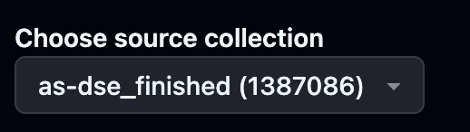
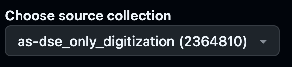
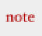
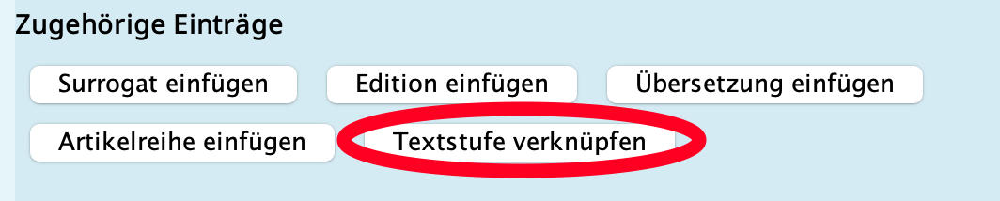

 # Dokumentation Vorgehen archivalische Textzeugen

[toc]

## Grundsätzliche Überlegung zur Textgenetik

Die dipolomatische Transkription von Überarbeitungen in Typo- und Manuskripten soll kein vollständiges Bild jeglicher Überarbeitungsphänomene bieten. Statdessen ist es eine Hilfestellung bei der Lektüre des daneben eingeblendeten Digitalisats. Deshalb wird beispielsweise darauf verzichtet, jede Überschreibung und Sofortkorrektur auszuzeichnen, wo solche ausgezeichnet werden, folgen sie einem einfachen Schema.

## Nicht-Edition von Kopien und Durchschlägen

Textzeugen desselben Werkes, die weitgehend Duplikate anderer Textzeugen sind (aufgrund Durchschlag, Kopie, Abschrift) werden nicht ediert, sondern lediglich als Digitalisat zur Verfügung gestellt. 
Hierfür durchläuft das Dokument denselben Prozess wie alle anderen, nur dass es auf Transkribus nicht transkribiert, sondern aus der Collection 'as-dse_wait' (nach kurzer Überprüfung von Vollständigkeit und korrekter Reihenfolge) direkt in die Collection 'as-dse_only_digitization' verschoben werden kann.
:::warning
Das Dokument muss im Export aus Transkribus immer auch aus dieser Collection geholt werden, in der Voreinstellung des export-issues gilt es also die Quelle zu wechseln, sonst gelingt der Export nicht: 

->


:::

Im GoogleSheet 'Kleine Formen' wird im Überarbeitungsstatus das Kürzel `KE` (für 'keine Edition') den üblichen Bearbeitungskürzeln vorangesetzt. Im Falle eines abgeschlossenen, nicht edierten Dokumentes entsteht z.B. folgende Zeichenreihe:`KE ez_tf_o`

## Transkriptionen und Auszeichnungen

### Änderung des Schreibwerkzeugs

In der Regel werden unterschiedliche Schreibwerkzeuge im TEI-Header ausgewiesen (Codierung noch unklar, zunächst machen wir eine Notiz im Überblickskommentar).

Änderungen des Schreibwerkzeugs werden im Text selbst nur an signifikanten Stellen ausgewiesen. So wie es in Briefen wenig Sinn ergibt, die Signatur als handschriftlich mit einem anderen Schreibwerkzeug auszuweisen, muss auch nicht jede Sofortkorrektur auf ihr Schreibwerkzeug hin ausgezeichnet werden. 


### Korrekturen
Sofortkorrekturen einzelner Buchstaben als Überschreibung werden nur in semantisch signifikanten Fällen ausgezeichnet, z.B. bei Pluralbildung oder Änderung der Zeitform. Nicht ausgezeichnet werden offensichtliche Korrekturen von Verschreibern (z.B. sehr häufig: Gross- und Kleinschreibung). 

- Eine Überschreibung ist später in Oxygen als Löschung des Überschriebenen (Frameworkbutton 'Durchstreichung', Code:`<del></del>`) und Anfügung (Frameworkbutton 'add', Code:`<add place="inline"></add>`) der Überschreibung zu codieren. 
- Ist der darunterliegende Buchstabe nicht entzifferbar, wird in der Regel ebenfalls auf eine Auszeichnung verzichtet, bei längeren Passagen kann ein gap-element zwischen das del-element gelegt werden.
- Analog werden (oft mithilfe von Pfeilen oder 'Sprechblasen') innerhlab des Textes verschobene Textteile als Durchstreichung (am alten Ort) und Einfügung (am neuen Ort) gehandhabt.

Durchstreichungen werden pragmatisch transkribiert: Wo es offensichtlich ist, dass ein Zeichen mitdurchstrichen sein sollte (etwa nicht nur der Inhalt einer Klammer, sondern die Klammer selbst auch), wird dieses ebenfalls durchstrichen (da eine übriggelassene, leere Klammer in der Leseausgabe für Verwirrung sorgen wird und keinen semantischen Mehrwert besitzt).  

Korrekturen von Makrosturkturen (ganze Wörter, Sätze, Absätze etc.) werden wie üblich ausgezeichnet.

### Editorische Korrektur fehlerhafter Stellen
Korrekturen von unserer Seite sollen in der Lesefassung stehenbleiben (im Gegensatz zu den Sofortkorrekturen der Autorin). Ev. wird es im Frontend in Farbe oder punktiert unterstrichen. 

Was editorisch korrigiert wird: 
- Fehlende Punkte zwischen zwei Sätzen (notwendig zur flüssigen Lesbarkeit)
- Offensichtliche Verschreiber ('brennsnde Nächte' -> brennende Nächte)
- Fehlende Abstände zwischen Buchstaben ('dasDu' -> das Du)
- Wiederholungen desselben Wortes oder Wortbeginnes, wenn eines offensichtlich hätte getilgt werden sollen ('Aber ich sag sage nichts von der Heimlichkeit' -> Aber ich sage nichts von der Heimlichkeit)

Was editorisch **nicht** korrigiert wird: 
- Fehlende Punkte am Ende von Absätzen
- Fehlende Kommas (Ausnahme: Lesbarkeit wird beeinträchtigt, insbesondere in komplexen Hypotaxen)
- Falsche Groß- und Kleinschreibung

### Kommentierung nicht-codierbarer Überarbeitungsphänomene

Striche, Pfeile etc. die mehrere Partien des Dokumentes miteinander verbinden oder verschieben, werden nicht codiert. Sie sollten jedoch an den jeweiligen Stellen kommentiert werden. Wo es punktuelle Eingriffe sind, eignet sich die Kommentarfunktion ohne Textanker, da hier kein vorliegender Text, sondern ein ansonsten unsichtbares Phänomen im oder neben dem Text beschrieben wird. Im Framework lässt sie sich mit diesem Button einfügen:


Codierung: 
```xml
<note type="annotation" xml:id="n1">[Kommentar ohne Textanker]y</note>
```

## Reihung Textstufen

Die Reihenfolge der Textzeugen wird im TEI header auf Datenebene beschrieben (sollte jedoch auch in einem Kommentar zur Textgenetik kurz erklärt werden, v.a. warum diese Reihenfolge rekonsturiert wurde). 
Hier gibt es einen Button: 


Die Textzeugen werden immer vom frühesten zum spätesten verknüpft. Das heisst, dass die letzte Stufe (oftmals die Publikation, manchmal auch die weitestüberarbeitete Stufe) *keine* Verknüpfung merh erhält. Im Frontend wird die Reihenfolge trotzdem für jedes Dokument darstellbar.

Es lassen sich beliebig viele spätere Textstufen einfügen. Dies bildet Fälle ab, in denen auf der nächsten Stufe keine sinnvolle Reihenfolge, sondern eine Gleichzeitigkeit der Textzeugen angenommen werden muss (was insbesondere bei Duplikaten/Durschlägen der Fall ist, [s.o.](https://hackmd.io/DbuTiVpoRx-XKbVl6Sm6yQ?both#Nicht-Edition-von-Kopien-und-Durchschl%C3%A4gen))  

## Kommentierung Textgenetik

TBD: Braucht es einen Kommentar, der alle Textstufen umfasst (ähnlich wie der Korrespondenz-Kommentar, der alle Briefe an eine Person umfasst)? Oder soll der Textgenetik-Kommentar einfach mehrfach wiederholt werden, ggfls. leicht angepasst?

## Kommentierung Provenienz
TBD: Auch hier würde sich ein Kommentar auf einer Meta-Ebene anbieten, der für eine bestimmte Anzahl Archivdokumente gilt und mit diesen verknüpft wird.
