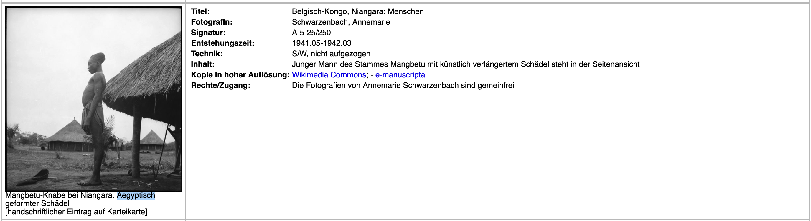
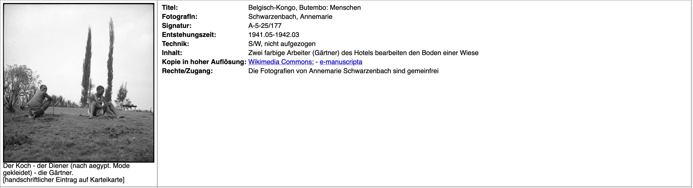
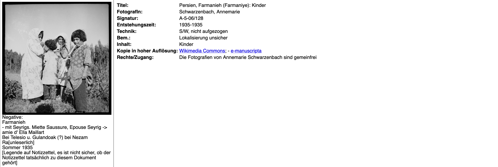
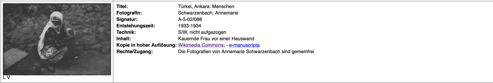

 # Richtlinien diskriminierungssensible Edition und Präsentation in der DSE-AS

Grundsätzliche Informationen zum Projekt: https://annemarie-schwarzenbach.ch/

Bisherige Präsentationen des Projektes, z.T. auch zum Umgang mit diskriminierenden Inhalten: https://zenodo.org/communities/dse-as

[toc]

## 0. Exemplarische Dokumente

Die folgende Auswahl ist nicht zwingend zu konsultieren, um die Richtlinien zu verstehen, kann aber einen genaueren Eindruck der Problemlagen vermitteln.

### Fotografien

Zur Übersicht über das fotografische Werk Schwarzenbachs ist das EAD des SLA am besten geeignet, da  Metadaten und zeitliche Abfolge am einfachsten ersichtlich sind: https://ead.nb.admin.ch/html/schwarzenbach.html.
Die 3475 Fotografien befinden sich auch in einer [Kollektion auf e-manuscripta](https://www.e-manuscripta.ch/search/quick?&query=schwarzenbach%2C%20annemarie&facets=collections%3D%2245%22) und einer [Kollektion auf wikimedia](https://commons.wikimedia.org/wiki/Category:CH-NB-Annemarie_Schwarzenbach).

Rassistisches/kolonial-ethnographisches Bildregime mit kraniologisch-rassifizierender Original-Bildbeschriftung (zugespitzt in den Metadaten):

- https://commons.wikimedia.org/wiki/File%3ACH-NB_-_Belgisch-Kongo%2C_Niangara-_Menschen_-_Annemarie_Schwarzenbach_-_SLA-Schwarzenbach-A-5-25-250.jpg

Bilder, die Fragen bezgüglich Entstehungskontext/Consent aufwerfen:

### Texte

Wir stellen hier vorläufig edierte Briefe und Kleine Formen (Feuilletons/Reportagen) in Form von PDFs und Links auf die Digitalisate zur Verfügung. Die Dateien sind *work in progress* und besitzen aus technischen Gründen noch keine Context Notes (CN) etc. Die folgende Reihenfolge ist jeweils nicht chronologisch, sondern eine Priorisierung aufgrund der diskriminierenden Textphänomene.

#### Briefe
- Brief an Erika Mann, 22.11.1941, Leopoldville: [Edition](https://drive.switch.ch/index.php/s/inJONmSFT3yVH5w)/[Digitalisat](https://uv-v4.netlify.app/#?manifest=https://iiif.annemarie-schwarzenbach.ch/presentation/letter_0186.json)
- [Brief an Carson McCullers, 29.7.1941, Molanda](https://uv-v4.netlify.app/#?manifest=https://iiif.annemarie-schwarzenbach.ch/presentation/letter_0136.json) - dieser Brief ist noch nicht ediert und deshalb nur als Digitalisat zugänglich.
- Brief an Claude Bourdet, 22. Mai 1934, Bocken: [Edition](https://drive.switch.ch/index.php/s/tB3cRWd8ihogARl)/[Digitalisat](https://uv-v4.netlify.app/#?manifest=https://iiif.annemarie-schwarzenbach.ch/presentation/letter_0033.json)

#### Kleine Formen
- Unbekanntes Washington. In: National-Zeitung Nr. 526, 11.11.1936 (Abendblatt), S. 1-2: [Edition](https://drive.switch.ch/index.php/s/cJd9b70YsqK9Emg)/[Digitalisat](https://uv-v4.netlify.app/#?manifest=https://iiif.annemarie-schwarzenbach.ch/presentation/smallform_0188.json)
- Eine christliche Stadt im Herzen Persiens. In: National-Zeitung Nr. 529, 14.11.1935 (Abendblatt), S. 1: [Edition](https://drive.switch.ch/index.php/s/sE0kjIm0ka5174e)/[Digitalisat](https://uv-v4.netlify.app/#?manifest=https://iiif.annemarie-schwarzenbach.ch/presentation/smallform_0158.json)  
- Schweizer Pionierarbeit im Urwald. III. Die Reise nach Molanda. IV. Zwölfhundertfünfzig Hektaren. In: Thurgauer Zeitung Nr. 273, 20.11.1941, 2. Bl: [Edition](https://drive.switch.ch/index.php/s/OYuezSSlJXhkrnX)/[Digitalisat](https://uv-v4.netlify.app/#?manifest=https://iiif.annemarie-schwarzenbach.ch/presentation/smallform_0529.json)

## 1. Grundsätze

**Ziel der Richtlinen**
Vermittlung der Texte (Briefe und Kleine Formen) und Fotografien Annemarie Schwarzenbachs in einer Form und mithilfe zusätzlicher Kontextinformationen, die diskriminierende, insbesondere rassistische und antisemitische Problematiken aufzeigen und sie historisch (sozial-, kunst-, literatur- und kulturwissenschaftlich) verorten.

Die zu edierenden Texte und Fotografien (Edenda) 
- müssen durch menschliche Nutzende in ihrer Gesamtheit auffindbar, zugänglich, interoperabel und wiederverwendbar sein (keine kuratierte Vorauswahl oder irreversible Maskierung aufgrund diskriminierender Inhalte).
- werden auf der Metabene (gesamtes Korpus), der Mesoebene (Einzeldokument) und der Mikroebene (Einzelstelle) durch kontextualisierende wissenschaftliche Texte begleitet (Metaebene = editoriale Kommentare, Mesoebene = Überblickskommentare, Mikroebene = Stellenkommentare). Dies gilt insbesondere für diskriminierende Aspekte des Korpus.
- müssen im Falle von diskriminierenden Inhalten von Context Notes (CN)  begleitet werden.
- werden so in TEI-XML codiert, dass diskriminierende Ausdrücke darin auffindbar sind (was maskierende Darstellungsweisen des edierten Textes grundsätzlich erlaubt, in der geplanten Edition jedoch zur Auszeichnung mit CN dient).
- sollen selbst diskriminierungssensibel ediert werden, insbesondere hinsichtlich der eigenen Terminologie, der Verwendung von kontrollierten Vokabularien und der Verlinkung von Dokumenten untereinander.

## 2. Präsentation diskriminierender Edenda
Digitalisate der Edenda werden in der Regel per default in ihrer Erstansicht so originalgetreu wie möglich dargestellt (keine Beschneidung, graphische Hervorhebung oder farbliche Änderung des Digitalisats).
Die editorischen Eingriffe zur diskriminierungssensiblen Vermittlung der Edenda finden in den sie begleitenden Metadaten, Kommentaren und den konstitutierten/edierten Texten statt. Diese Eingriffe sind (typo-)graphisch so gestaltet, dass sie nicht übersehen werden können, aber gleichzeitig das Lesen/Betrachten der Edition weiterhin erlauben. 

Eine Ausnahme dieses Grundsatzes stellen diskriminierende Fotografien dar. Solche liegen im Werk Schwarzenbachs hinsichtlich eines kolonialen/rassifizierenden Blickregimes bzw. Bildaufbaus vor (z.B. https://commons.wikimedia.org/wiki/File%3ACH-NB_-_Belgisch-Kongo%2C_Niangara-_Menschen_-_Annemarie_Schwarzenbach_-SLA-Schwarzenbach-A-5-25-250.jpg). Zwar werden auch diese Bilder vollständig in der Edition zugänglich gemacht (unabhängig hiervon sind sie bereits auf wikimedia und e-manuscripta zugänglich). Ihre Erstansicht soll jedoch auf die diskriminierende Problematik aufmerksam machen, indem sie zunächst verschwommen (blurred) oder auf andere Weise maskiert und/oder mit einer verdeckenden CN versehen werden. Durch diesen Verfremdungs- und Aktivierungseffekt wirkt die Edition der Suggestionskraft der Fotografien, insbesondere ihrer latenten Normalisierung von Diskriminierung, entgegen. 

:::info 
**Diskussionspunkt 1: Grundsätzlich vorgelagerte CN**

  z.B.: "Vor der Erstansicht, d.h. in der Vorschau, der Register-Auswahl oder in einem Pop Up vor dem Einblenden des Edendums muss  bereits eine CN eingeblendet werden, wenn das Edendum diskriminierende Inhalte aufweist."

 Problem dieser Herangehensweise: 
 - Blicklenkung nur noch auf diskriminierende Aspekte. Das ist angesichts längerer Texte und Briefe, die oftmals neben diskriminierenden auch antirassistische und/oder antifaschistische Aspekte aufweisen, problematisch und kann schnell zu Missverständnissen führen.
 - Im Falle von Fotografien erachten wir dieses Problem als kleiner; das  primäre Blurring mit CN *soll* den Blick auf den Aufbau des Bildes lenken, dessen diskriminierenden Aspekte einem unvorbereiteten Blick entgehen können. 
:::

### 2.1 Fotografien

**Rassistische Bildregime**:
- Blurring (o.ä.) von Thumbnails und Erstansicht. Erst durch Klicken auf das verschwommene Bild wird es originalgetreu ansehbar. CN-Erklärung über dem Blurring: "Diese Fotografie wird aufgrund rassistischer/diskriminierender Bildpraktiken erst nach Anklicken angezeigt."
- CN im Metadaten-Block an vorderer Stelle und farblich hervorgehoben (ausgeklappt): "Diese Fotografie steht in der Tradtion rassistischer/diskriminierender Bildpraktiken." Verlinkung der CN mit editorialem Kommentar zu rassistischen Bildpraktiken.

:::warning
**Problem: Fotografiegeschichtliches Wissen**

In diesem Punkt liegt wohl die größte Herausforderung für uns als nicht-Fotografiehistoriker:innen: Welche Bilder stehen wirklich in der Tradition rassistischer/diskriminierener Bildpraktiken? Wieviel Unsicherheit sollen wir zu erkennen geben ("potenziell in der Tradition")?

Wir stehen mit Bärbel Küster (UZH) in Kontakt, sind aber über Hinweise auf weitere, an einem Austausch interessierte Fachpersonen sehr dankbar.
:::

:::info
**Diskussionspunkt 2: Entstehungskontext/Consent**

Wie/wo adressieren wir einen möglicherweise problematischen **Entstehungskontext** (z.B. fehlenden, erkauften, erschleichten **Consent** der Fotografierten) und fehlenden Consent der Nachkommen von Fotografierten bei ihrer Präsentation/Weiterverbreitung 100 Jahre später? 
- Welche best practice gibt es hierzu im GLAM-Bereich?
- Ist ein CN bezüglich Consent sinnvoll? 
- Falls ja, weisen wir darauf hin, dass wir bzw. das Archiv Informationen über mögliche Nachkommen aufnehmen? Zentral wäre hierbei die Transparenz bezüglich: 
    - Persönlichkeitsrechte (können Nachkommen die Verbreitung des Fotos verbieten, wären wir oder das Archiv bereit, die Verbreitung freiwillig einzuschränken?)
    - Zuständigkeiten (das gemeinfreie Fotomaterial ist im Besitz des SLA, die gezeigten Digitalisate sind auf unseren Servern ABER auch auf e-manuscripta und wikimedia) 
    - Zeiträume (das Projekt ist mit großer Wahrscheinlichkeit bereits beendet zum Zeitpunkt, zu dem sich Nachkommen melden könnten, inwiefern kann wer dann noch Anpassungen vornehmen?)

(Schwarzenbach thematisiert selbst in einer Amerika-Reportage, dass Arbeiter gedroht haben, ihre Kamera zu zerstören, wenn sie sie weiterhin fotografiere [smallform_0201, smallform_0206], sie scheint die Fotografien z.T. enwickelt, aber nicht publiziert zu haben. Es war also schon zu Lebzeiten ein Thema.)
:::

**Diskriminierende Ausdrücke** in der Beschriftung:
- CN im im Metadaten-Block an vorderer Stelle und farblich hervorgehoben (ausgeklappt): "Die Beschriftung der Fotografie weist diskriminierende Ausdrücke auf." Verlinkung der CN mit editorialem Kommentar zu rassistischen Begrifflichkeiten.
- CN als farblich hervorgehobener Stellenkommentar im edierten Text der Beschriftung: "Schwarzenbach verwendete das N-Wort/Z-Wort/I-Wort unreflektiert im Kontext ihrer Zeit. Obschon hinter Schwarzenbachs Verwendung des Wortes nicht zwingend eine ~~rassistische~~ feindselige Intention lag, nahm sie dadurch an Praktiken teil, die schon zu ihrer Zeit diskriminierend waren." Verlinkung der CN mit editorialem Kommentar zu rassistischen Begrifflichkeiten.

**Diskriminierenden Diskurse** in den Beschriftungen von Fotografien: 
- Hinweis auf den auftauchenden diskriminierenden Diskurs an vorderer Stelle im Metadaten-Block, in dem relevante editoriale Kommentare verlinkt sind.
- Individueller Stellenkommentar, in dem nochmals relevante editoriale Kommentare verlinkt sind.

### 2.2 Texte
**Rassistischen Ausdrücke** im Text: Identisches Vorgehen wie bei Fotografie-Beschriftungen (s.o.).

**Diskriminierende Diskurse**: 
- Grundsätzlich gleiches Vorgehen wie bei diskriminierenden Diskursen in Beschriftungen von Fotografien.
- In der Textgattung Kleine Formen: Hinweis auf den auftauchenden rassistischen Diskurs an entsprechender Stelle (in der Regel: Entstehungskontext) im Überblickskommentar (nur Kleine Formen weisen zwingend einen solchen Kommentar auf). Verlinkung des Metadaten-Feldes mit editorialen Kommentaren. 

## 3. Editoriale Kommentare (Metaebene)

Eine Anregung für die Praxis editorialer Kommentierung bot die Edition ["The Letters of Belle da Costa Greene to Bernard Berenson"](https://bellegreene.itatti.harvard.edu/resource/Start), deren letzter Abschnitt der [editorial notes](https://bellegreene.itatti.harvard.edu/resource/EditorialNotes) der "racist language" gewidmet ist und separat "race and ethnicity" als ein [Themenfeld](https://bellegreene.itatti.harvard.edu/resource/Themes) durch eine Auswahl von Briefen zugänglich macht. 
Der vorliegende Ansatz kombiniert und erweitert diese beiden Angebote. 

### 3.1 Anforderungen

- Die editorialen Kommentare sollen in die Problematiken einführen und zentrale Sekundärliteratur zu den Themen und ihrer Relevanz im Werk Schwarzenbachs versammeln. 
- Im Fließtext verweisen die editorialen Kommentare auf wichtige Beispiele innerhalb des edierten Korpus. Am Ende des Kommentars findet sich zudem eine Auflistung aller Dokumente, die mit diesem Kommentar verknüpft sind.
- Die editorialen Kommentare selbst haben nicht die Länge und den Erklärungsanspruch eines wissenschaftlichen Aufsatzes, sie sollen in 10-15 min. lesbar sein. (Zu möglichen Themen schreiben Editor:innen längere wissenschaftliche Aufsätze, diese können ggfls. als PDF zugänglich gemacht werden).

### 3.2 Themen 

Die finale Auswahl und Redaktion relevanter Themen erfolgt in der Schlussphase des Projektes 2028.

- rassistische Bildpraktiken
    (- potenziell problematischer Entstheungskontext / fehlender Consent)
- rassistische Begrifflichkeiten
    - N-Wort
    - I-Wort
    - Z-Wort
- diskriminierende Diskurse (insbesondere auch 'positiver Rassismus', 'white man's burden', paternalistische Diskurse - ev. in Unterkategorien aufteilen)
    - Rassentheorie
    - Kolonialismus
    - Orientalismus
    (- Antisemitismus)

:::info 
**Diskussionspunkt 3: Status der editorialen Kommentare**
Noch ungeklärt ist die Frage, ob auch editoriale Kommentare zu nicht-diskriminierenden Aspekten geschreiben werden (z.B. zur Rolle Schwarzenbachs in der deutschen Exilgemeinschaft, zu ihrer Verortung in Queerness-Diskursen der 1930er und 1940er Jahre, zu ihren Text- und Fotografie-Praktiken, zu literarischen Netzwerken, zu ihrem Drogenkosnum). Falls hierfür die zeitlichen Ressourcen ausreichen:
- Sollen diskriminierungssensible editoriale und weitere Themen denselben Status erhalten oder zwei verschiedene Kategorien bilden?
- Oder sollen die Kategorien unabhängig von der Frag der Diskriminierung gebildet werden (z.B.: Praktiken, Diskurse, Neztwerke)?
:::

## 4. Diskriminierungssensible editorische Praxis

Neben der den oben beschriebenen Richtlinien zum Umgang mit diskriminierenden Edenda legt die Edition Wert darauf, auch in davon unabhängigen editorischen Entscheidungen diskriminierungssensibel vorzugehen und die eigene editorische Praxis zu reflektieren.

### 4.1 Diskriminierungssensible Sprache

Die Edition verwendet in Kommentaren gendergerechte Sprache (Verwendung des Binnen-Doppelpunktes). Diskriminierende Ausdrücke werden, wo ihre erklärende Reproduktion unausweichlich ist, maskiert ('N-Wort'). Historische Begriffe des Nationalsozialismus/Faschismus/Kolonialismus (z.B. 'Röhm-Putsch', 'Halbjude', 'Diener' für Sklav:innen) werden in einfache Anführungszeichen gesetzt und wo nötig als problematisch analysiert.

:::info
**Diskussionspunkt 4: Eigene Begrifflichkeiten**

Um rassistische Begriffe nicht zu reproduzieren, verwenden wir in Kommentaren den Ausdruck 'N-Wort','Z-Wort' und 'I-Wort' (weitere sind bislang nicht aufgetaucht). Gäbe es andere, ev. bessere Praktiken?

Einheitliche Bezeichnungen für rassifizierte Menschen (z.B. People of Colour) exisitert in den Kommentierungsrichtlinien (noch) nicht; Editor:innen verwenden z.B. 'Schwarze' (Grosschreibung) oder schwarze Bevölkerung (Kleinschreibung). Welche Richtlinien/Praktiken gibt es diesbezüglich im GLAM-Bereich?

Neben einer diskriminierungssensiblen Kommentierung streben wir auch eine breitestmögliche Verständlichkeit an, was spezialisisierte Ausdrücke/Abkürzungen wie POC oder BIPOC potentiell schwierig macht.
:::

### 4.2 Kontrollierte Vokabularien

Zurzeit wird für Sachbegriffe zur Verschlagwortung von Edenda das Vokabular der GND verwendet. Dieses wurde zu Recht für seine Lückenhaftigkeit und fehlende Diskriminierungssensibilität kritisiert (vgl. [Handbuch zur Erstellung diskriminierungsfreier Metadaten für historische Quellen und Forschungsdaten](https://maehr.github.io/diskriminierungsfreie-metadaten/)). 

Die verwendeten GND-Sachbegriffe sollen in der Schlussphase evaluiert werden (insbesondere hinsichtlich bislang dort fehlender geschlechtergerechter Sprache), einerseits bezüglich der Problematik der tatsächlich verwendeten Begriffe, andererseits bezüglich derzeitiger Bestrebungen seitens der GND, das Vokabular anzupassen.

Dank dem Mapping zu GenderOpen ist der Wechsel auf diese  zu erwägen. Auch sollten 2028 weitere mögliche Thesauri evaluiert werden (bestehen Mappings, könnten welche hergestellt werden?). 

### 4.3 Verlinkung von Edenda untereinander

In der Auswahl der Verlinkung von Edenda in in Übersichtsseiten, welche Einstiegspfade in die Edition ermöglichen, sowie in Übersichts- und Stellenkommentaren wird darauf geachtet, dass keine diskriminierende Auswahl entsteht. Dies gilt insbesondere für die Auswahl von Fotografien (z.B. Vermeidung einer Präferenz männlicher, weisser etc. Personen auf 'exemplarischen' Fotografien). 

### 4.4 Entitäten

In der Schaffung der Register-Entitäten (Orte, Personen, Organisationen, Werke) wird darauf geachtet, dass auch weitgehend unbekannte Entitäten aufgenommen werden, selbst wenn diese keine Normdaten-Einträge besitzen. Dies gilt insbesondere auch für subalterne oder marginalisiete Personen, von denen aufgrund fehlender Hintergrundinformationen keine Normdaten erzeugt werden können. Sie sollen trotzdem im Personen-Register auftauchen und somit über mehrere Dokumente hinweg auffindbar sein. Personen ohne GND-Eintrag, deren Vor- und Nachnamen sowie deren Lebensdaten (Geburts- oder Sterbedatum oder Wirkungszeit) ausgemacht werden können, werden via ZB-Formular in die GND aufgenommen.
