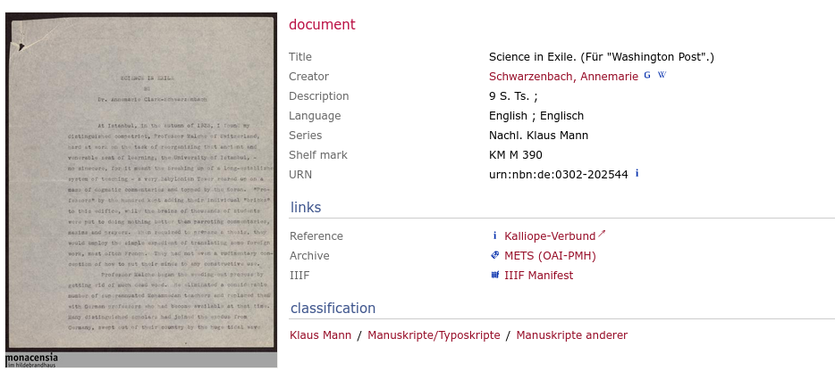
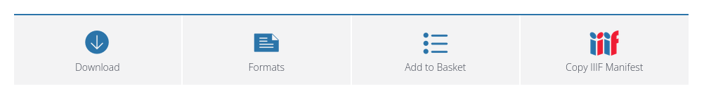

# IIIF-Manifest anlegen

Manifeste können in einem automatisierten Prozess angelegt werden, vgl. [https://github.com/dse-as/i3f](https://github.com/dse-as/i3f/).

## Erforderliche Angaben für die Input-Dateien

* Dokument-ID (`mf_id`): entspricht der Dokument-ID des Projekts nach Konvention `typ_nnnn` ergänzt mit der Endung `.json`
* Manifest-Sprache (`mf_en`): Sprachangabe für Metadaten-Labels, z.B. "de", "fr", "en", vgl. https://iiif.io/api/cookbook/recipe/0006-text-language/
* Label des Dokuments (`mf_label`): Angabe als einfacher String ohne *Quotation Mark* (`U+0022`), stattdessen „ “ / » « / ' ' / › ‹ / ‚ ‘ / ‘ ’  o.ä. verwenden (vgl. https://de.wikipedia.org/wiki/Anf%C3%BChrungszeichen#Andere_Sprachen)
* Auflistung von Seiten-IDs und zugehörigen IIIF-Image-URLs (unter `[mf_data]`)

## `[mf_data]`

Unter `[mf_data]` werden alle zum Dokument gehörigen Seiten als einzelne Zeile eingetragen.

Jede Zeile enthält zwei Werte, getrennt durch "=". 

* Auf der linken Seite steht die Seiten-ID, die der Dokument-ID ergänzt um einen dreistelligen Index entspricht (`typ_nnnn_iii`).
* Auf der rechten Seite steht der Verweis auf die JSON-Repräsentation des IIIF-Image-Ressource.

### IIIF Image URLs ermitteln

Da die Adressstruktur der verschiedenen Institutionen/Server abweicht, können folgende Hinweise helfen:

#### iiif.ub.unibe.ch

Image URLs lauten (vorläufig) 

```
https://iiif.ub.unibe.ch/image/v3/dsl_dev/smallform_0007_001.png/info.json
```
bzw.

```
https://iiif.ub.unibe.ch/image/v3/dsl_dev/{Seiten-ID}.png/info.json
```

[in absehbarer Zeit wird das Pfadsegment `dsl_dev` durch `schwarzenbach` ersetzt; letztlich voraussichtlich der Hostname `iiif.ub.unibe.ch` durch `iiif.annemarie-schwarzenbach.ch`].


#### monacensia-digital.de/i3f

Die Patrinum-Plattform bietet auf der Dokumentansicht einen Link zum zugehörigen IIIF Presentation Manifests an:



In diesem JSON sind die Image URLs unter `.sequences[:0].canvases[:0].images[:0].resource.service` als `@id` (abfragbar z.B. mit https://jsonpath.com/).

⚡ Eine einfache Möglichkeit, an `[md_data]` zu kommen, bietet [diese Fiddle](https://martin-honnen.github.io/xslt3fiddle/?xslt=%3C%3Fxml+version%3D%221.0%22+encoding%3D%22utf-8%22%3F%3E%0D%0A%3Cxsl%3Astylesheet+xmlns%3Axsl%3D%22http%3A%2F%2Fwww.w3.org%2F1999%2FXSL%2FTransform%22%0D%0A++xmlns%3Amap%3D%22http%3A%2F%2Fwww.w3.org%2F2005%2Fxpath-functions%2Fmap%22%0D%0A++version%3D%223.0%22%0D%0A++xmlns%3Axs%3D%22http%3A%2F%2Fwww.w3.org%2F2001%2FXMLSchema%22%0D%0A++exclude-result-prefixes%3D%22%23all%22%0D%0A++expand-text%3D%22yes%22%3E%0D%0A++%0D%0A++%3Cxsl%3Aoutput+method%3D%22text%22%2F%3E%0D%0A%0D%0A++%3Cxsl%3Amode+on-no-match%3D%22shallow-copy%22%2F%3E%0D%0A%0D%0A++%3Cxsl%3Atemplate+match%3D%22%2Finput%22+name%3D%22xsl%3Ainitial-template%22%3E%0D%0A++++%3Cxsl%3Avariable+name%3D%22id%22+select%3D%22%40id%22%2F%3E%0D%0A++++%3Cxsl%3Avariable+name%3D%22input%22+select%3D%22%40manifest+%3D%3E+normalize-space%28%29+%3D%3E+json-doc%28%29%22%2F%3E%0D%0A++++%3Cxsl%3Atext%3E%5Bmf_data%5D%26%23xA%3B%3C%2Fxsl%3Atext%3E%0D%0A++++%3Cxsl%3Afor-each+select%3D%22%24input%3Fsequences%3F*%3Fcanvases%3F*%3Fimages%3F*%3Fresource%3Fservice%22%3E%22%7B%24id%7D_%7Bposition%28%29%3D%3Eformat-number%28%27000%27%29%7D%22+%3D+%22%7Bmap%3Afind%28.%2C%27%40id%27%29%7D%22%26%23xA%3B%3C%2Fxsl%3Afor-each%3E%0D%0A++%3C%2Fxsl%3Atemplate%3E%0D%0A++%0D%0A%3C%2Fxsl%3Astylesheet%3E&input=%3Cinput%0A++id%3D%22smallform_598%22%0A++manifest%3D%22https%3A%2F%2Fwww.monacensia-digital.de%2Fi3f%2Fv20%2F415207%2Fmanifest%22%0A++%2F%3E&input-type=XML)

Input:
```xml
<input
  id="smallform_598"
  manifest="https://www.monacensia-digital.de/i3f/v20/415207/manifest"
  />
```

Output:
```
"smallform_598_001" = "https://www.monacensia-digital.de/i3f/v20/415208"
"smallform_598_002" = "https://www.monacensia-digital.de/i3f/v20/415209"
"smallform_598_003" = "https://www.monacensia-digital.de/i3f/v20/415210"
"smallform_598_004" = "https://www.monacensia-digital.de/i3f/v20/415211"
"smallform_598_005" = "https://www.monacensia-digital.de/i3f/v20/415212"
"smallform_598_006" = "https://www.monacensia-digital.de/i3f/v20/415213"
"smallform_598_007" = "https://www.monacensia-digital.de/i3f/v20/415214"
"smallform_598_008" = "https://www.monacensia-digital.de/i3f/v20/415215"
"smallform_598_009" = "https://www.monacensia-digital.de/i3f/v20/415216"
```

<details><summary>Code of the fiddle</summary>

```xml
<?xml version="1.0" encoding="utf-8"?>
<xsl:stylesheet xmlns:xsl="http://www.w3.org/1999/XSL/Transform"
  xmlns:map="http://www.w3.org/2005/xpath-functions/map"
  version="3.0"
  xmlns:xs="http://www.w3.org/2001/XMLSchema"
  exclude-result-prefixes="#all"
  expand-text="yes">
  
  <xsl:output method="text"/>

  <xsl:mode on-no-match="shallow-copy"/>

  <xsl:template match="/input" name="xsl:initial-template">
    <xsl:variable name="id" select="@id"/>
    <xsl:variable name="input" select="@manifest => normalize-space() => json-doc()"/>
    <xsl:text>[mf_data]&#xA;</xsl:text>
    <xsl:for-each select="$input?sequences?*?canvases?*?images?*?resource?service">"{$id}_{position()=>format-number('000')}" = "{map:find(.,'@id')}"&#xA;</xsl:for-each>
  </xsl:template>
  
</xsl:stylesheet>
```

</details>

#### patrinum

Die Patrinum-Plattform bietet eine Schaltfläche an, mit der sich die URL des IIIF Presentation Manifests kopieren lässt:



In diesem JSON sind die Image URLs unter `.items[:0].items[:0].items[:0].body.id` (abfragbar z.B. mit https://jsonpath.com/).

⚡ Eine einfache Möglichkeit, an `[md_data]` zu kommen, bietet [diese Fiddle](https://martin-honnen.github.io/xslt3fiddle/?xslt=%3C%3Fxml+version%3D%221.0%22+encoding%3D%22utf-8%22%3F%3E%0D%0A%3Cxsl%3Astylesheet+xmlns%3Axsl%3D%22http%3A%2F%2Fwww.w3.org%2F1999%2FXSL%2FTransform%22%0D%0A++xmlns%3Amap%3D%22http%3A%2F%2Fwww.w3.org%2F2005%2Fxpath-functions%2Fmap%22%0D%0A++version%3D%223.0%22%0D%0A++xmlns%3Axs%3D%22http%3A%2F%2Fwww.w3.org%2F2001%2FXMLSchema%22%0D%0A++exclude-result-prefixes%3D%22%23all%22%0D%0A++expand-text%3D%22yes%22%3E%0D%0A++%0D%0A++%3Cxsl%3Aoutput+method%3D%22text%22%2F%3E%0D%0A%0D%0A++%3Cxsl%3Amode+on-no-match%3D%22shallow-copy%22%2F%3E%0D%0A%0D%0A++%3Cxsl%3Atemplate+match%3D%22%2Finput%22+name%3D%22xsl%3Ainitial-template%22%3E%0D%0A++++%3Cxsl%3Avariable+name%3D%22id%22+select%3D%22%40id%22%2F%3E%0D%0A++++%3Cxsl%3Avariable+name%3D%22input%22+select%3D%22%40manifest+%3D%3E+normalize-space%28%29+%3D%3E+json-doc%28%29%22%2F%3E%0D%0A++++%3Cxsl%3Afor-each+select%3D%22%24input%3Fitems%3F*%3Fitems%3F*%3Fitems%3F*%3Fbody%3Fid%22%3E%22%7B%24id%7D_%7Bposition%28%29%3D%3Eformat-number%28%27000%27%29%7D%22+%3D+%22%7B.%7D%2Finfo.json%22%26%23xA%3B%3C%2Fxsl%3Afor-each%3E%0D%0A++%3C%2Fxsl%3Atemplate%3E%0D%0A++%0D%0A%3C%2Fxsl%3Astylesheet%3E&input=%3Cinput%0A++id%3D%22letter_1234%22%0A++manifest%3D%22https%3A%2F%2Fpatrinum.ch%2Fnanna%2Fproxy%2Fiiif%2Fmanifest%2F587676%2F%22%0A++%2F%3E&input-type=XML).

Hier lassen sich im Input-Panel (links) die Dokument-ID und die Patrinum-Manifest-URL angeben und über die Schaltfläche "transform" ein Output der folgenden Form erzeugen (unten rechts), der sich in die `.toml`-Datei einfügen lässt:

Input:
```xml
<input
  id="letter_1234"
  manifest="https://patrinum.ch/nanna/proxy/iiif/manifest/587676/"
  />
```

Output:
```
"letter_1234_001" = "https://patrinum.ch/nanna/api/multimedia/image/v2/recid:587676-BCUL-PREVIEW-426354_0001.jpg"
"letter_1234_002" = "https://patrinum.ch/nanna/api/multimedia/image/v2/recid:587676-BCUL-PREVIEW-426354_0002.jpg"
"letter_1234_003" = "https://patrinum.ch/nanna/api/multimedia/image/v2/recid:587676-BCUL-PREVIEW-426354_0003.jpg"
```

<details><summary>Code of the fiddle</summary>

```xml
<?xml version="1.0" encoding="utf-8"?>
<xsl:stylesheet xmlns:xsl="http://www.w3.org/1999/XSL/Transform"
  xmlns:map="http://www.w3.org/2005/xpath-functions/map"
  version="3.0"
  xmlns:xs="http://www.w3.org/2001/XMLSchema"
  exclude-result-prefixes="#all"
  expand-text="yes">
  
  <xsl:output method="text"/>

  <xsl:mode on-no-match="shallow-copy"/>

  <xsl:template match="/input" name="xsl:initial-template">
    <xsl:variable name="id" select="@id"/>
    <xsl:variable name="input" select="@manifest => normalize-space() => json-doc()"/>
    <xsl:text>[mf_data]&#xA;</xsl:text>
    <xsl:for-each select="$input?items?*?items?*?items?*?body?id">"{$id}_{position()=>format-number('000')}" = "{.}"&#xA;</xsl:for-each>
  </xsl:template>
  
</xsl:stylesheet>
```

</details>

#### iiif.library.ethz.ch

TBD

---

#### Allgemeiner Hinweis

Ob es sich um eine funktionierende Image URL handelt, lässt sich einfach prüfen, indem man das Pfadsegment `/info.json` durch `/full/max/0/default.jpg` ersetzt und die URL im Browser öffnet. Bei einer Image URL sollte das Bild in Vollqualität angezeigt werden.

## Beispiel der Input-Datei `smallform_0007.toml`:

```
mf_id = "smallform_0007.json"
mf_lang = "en"
mf_label = "Erik. Novelle"

[mf_data]
"smallform_0007_001" = "https://iiif.ub.unibe.ch/image/v3/dsl_dev/smallform_0007_001.png/info.json"
```
